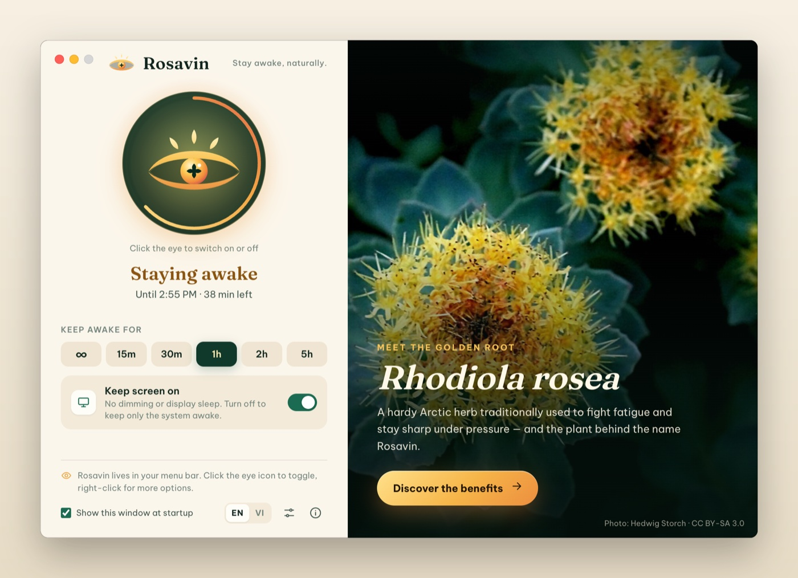
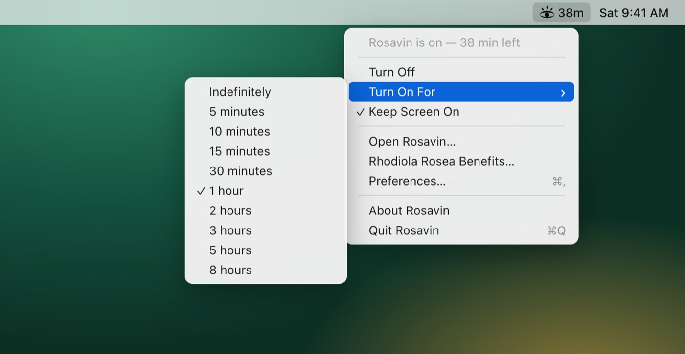
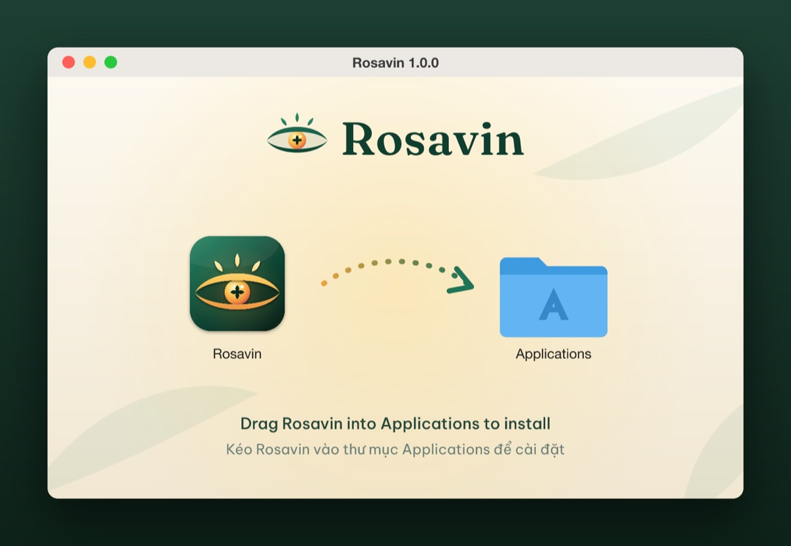

<p align="center">
  <picture>
    <source media="(prefers-color-scheme: dark)" srcset="docs/images/logo-dark.png">
    
  </picture>
</p>

<p align="center">
  <b>Keep your Mac or Windows PC awake — with one click.</b><br>
  A tiny menu bar / system tray app with a golden-root soul.
</p>

<p align="center">
  <a href="#download--install">Download</a> ·
  <a href="docs/USER_GUIDE.en.md">User guide</a> ·
  <a href="docs/USER_GUIDE.vi.md">Hướng dẫn tiếng Việt</a> ·
  <a href="#rhodiola-rosea-the-golden-root">Rhodiola rosea</a> ·
  <a href="#run-from-source">Run from source</a>
</p>

<p align="center">
  
</p>

---

## What is Rosavin?

Rosavin stops your computer from **going to sleep, dimming the screen or starting the screen saver** while you need it: presentations, long downloads, builds, video calls, reading a long article or monitoring a dashboard.

It lives in the macOS menu bar (or the Windows system tray) as a small eye:

| Icon | Meaning |
| --- | --- |
| Closed eye | **Off.** Your computer sleeps normally. |
| Open eye with rays | **On.** Rosavin keeps your computer awake. |

**Click the eye** to switch Rosavin on or off. **Right-click** it (or **⌘-click** on a Mac) for timers and settings.

The app is named after **rosavin**, the signature compound of *Rhodiola rosea*, the Arctic "golden root" traditionally used to fight fatigue. A button in the app opens a richly illustrated guide to the plant's health benefits and how it helps people stay awake.

## Features

- **One-click keep-awake** from the menu bar / system tray, with an animated open/closed eye.
- **Timers:** keep awake indefinitely or for 5 min, 10 min, 15 min, 30 min, 1 h, 2 h, 3 h, 5 h or 8 h. Rosavin switches itself off and can notify you.
- **Countdown next to the icon** (macOS), e.g. `38m`.
- **Keep screen on** (no dimming, no screen saver) **or system only** (the display may sleep, the computer keeps running for downloads and renders).
- **Beautiful main window** with quick-duration chips, a progress ring and a Rhodiola rosea panel.
- **Rhodiola rosea guide:** benefits with evidence levels, how it keeps you awake, safe use, a photo gallery and 19 scientific sources.
- **Preferences:** start at login, turn on at launch, default duration, click behaviour, notifications, theme (system / light / dark).
- **English and Vietnamese** user interface (follows your system language, or choose one).
- **Automation:** `rosavin://` links and command-line flags for Shortcuts, scripts and launchers.
- **Private by design:** no network access, no analytics, no accounts.
- **Lightweight on resources:** uses the operating system's own power APIs; nothing runs in the background when Rosavin is off.

<p align="center">
  <br>
  
</p>

## Download & install

### macOS (13 Ventura or later)

Download the disk image that matches your Mac from the **Releases** page of this repository:

| File | For |
| --- | --- |
| `Rosavin-1.0.0-arm64.dmg` | Apple Silicon Macs (M1, M2, M3, M4…) — smallest download |
| `Rosavin-1.0.0-x64.dmg` | Intel Macs |
| `Rosavin-1.0.0-universal.dmg` | Any Mac (not sure which chip you have? pick this one) |

*To check your chip: Apple menu › About This Mac › "Chip" (Apple M…) or "Processor" (Intel).*

1. Open the `.dmg` file and drag **Rosavin** into **Applications**.

   

2. Open **Rosavin** from Applications (or Launchpad / Spotlight).
3. **First launch only:** Rosavin is free and open source and is not notarized by Apple (that requires a paid Apple Developer account), so macOS asks you to confirm it once:
   - **macOS 15 Sequoia and later:** when you see *"Rosavin" Not Opened*, click **Done**. Open **System Settings › Privacy & Security**, scroll down to **Security**, click **Open Anyway** next to *"Rosavin" was blocked…*, confirm with your password or Touch ID, then click **Open Anyway** again.
   - **macOS 13 Ventura / 14 Sonoma:** in Applications, **Control-click** (right-click) Rosavin, choose **Open**, then click **Open**.
   - Prefer Terminal? This does the same thing:

     ```bash
     xattr -dr com.apple.quarantine /Applications/Rosavin.app
     ```

4. Look for the eye icon in the menu bar. That's it.

### Windows 10 / 11

Build the installer with `npm run dist:win` (see [Build installers](#build-installers)) and run `Rosavin Setup 1.0.0.exe`. Unsigned installers trigger Microsoft Defender SmartScreen: click **More info › Run anyway**. Rosavin then appears in the system tray (click **^** next to the clock if the icon is hidden; you can drag it onto the taskbar to keep it visible).

## Using Rosavin

| To… | Do this |
| --- | --- |
| Turn Rosavin on / off | Click the eye icon in the menu bar / tray, or the big eye in the window |
| Keep awake for a set time | Right-click the icon › **Turn On For** › pick a duration, or click a chip (∞, 15m, 30m, 1h, 2h, 5h) in the window |
| Let the display sleep but keep the computer running | Untick **Keep Screen On** (menu) or switch it off in the window |
| Open the window | Right-click the icon › **Open Rosavin…** |
| Read about Rhodiola rosea | Click **Discover the benefits** in the window, or menu › **Rhodiola Rosea Benefits…** |
| Change settings | Window › sliders button, menu › **Preferences…**, or **⌘,** |
| Quit | Menu › **Quit Rosavin** (or **⌘Q** while the window is focused) |

Closing the window does not quit Rosavin: it keeps running in the menu bar / tray.

The full illustrated walkthrough is in the user guide: **[English](docs/USER_GUIDE.en.md)** ([.docx](docs/USER_GUIDE.en.docx)) · **[Tiếng Việt](docs/USER_GUIDE.vi.md)** ([.docx](docs/USER_GUIDE.vi.docx)).

### Automation

```bash
# macOS
open "rosavin://activate?minutes=30"   # keep awake for 30 minutes
open "rosavin://activate"              # keep awake (default duration)
open "rosavin://deactivate"
open "rosavin://toggle"
/Applications/Rosavin.app/Contents/MacOS/Rosavin --activate=60

# Windows (PowerShell or cmd)
start rosavin://activate?minutes=30
"%LOCALAPPDATA%\Programs\Rosavin\Rosavin.exe" --deactivate
```

Supported actions: `activate` (optional `minutes`, 0 = indefinitely), `deactivate`, `toggle`, `show`, `benefits`, `preferences`. Add `--hidden` to start Rosavin without opening its window. Commands sent while Rosavin is running are forwarded to the running app.

## Rhodiola rosea, the golden root


<sub>Rhodiola rosea on the coast of Norway. Photo: Finn Rindahl, CC BY-SA 3.0.</sub>

*Rhodiola rosea* (golden root, Arctic root, rose root; in Vietnamese *hồng cảnh thiên*) is a hardy succulent of the stonecrop family that grows on cold Arctic coasts and high mountains across Europe, Asia and North America. Its golden, rose-scented root has been used for centuries in Scandinavia, Russia and the Caucasus to push through fatigue and stay sharp under pressure. Today it is one of the most studied **adaptogens**: plants thought to help the body resist and recover from stress. The European Medicines Agency recognises it as a traditional herbal medicine for the temporary relief of stress symptoms such as fatigue and weakness.

### Health benefits

| Benefit | What studies suggest | Evidence |
| --- | --- | --- |
| **Less fatigue, more energy** | Less mental fatigue in physicians on night duty, students during exams and adults with stress-related fatigue or burnout [2][4][5][6][7] | Promising |
| **Sharper focus under pressure** | Better attention, concentration and mental work capacity during demanding, sleep-deprived periods [2][3][5] | Some |
| **Stress resilience** | Balances the stress-response system; linked to a healthier cortisol response and fewer stress symptoms [1][5][13] | Some |
| **Brighter mood** | Modest benefit for mild-to-moderate low mood, with fewer side effects than a standard antidepressant but a weaker effect [8][9] | Early |
| **Physical endurance** | Better endurance and less perceived effort in some studies, no effect in others [10][11][15] | Early |
| **Cell protection** | Antioxidant and protective effects of salidroside in lab and animal studies [1][14] | Early |

### How it helps people stay awake

Rhodiola is **not a classic stimulant**. Instead of forcing the nervous system into overdrive, it appears to help the body cope with the stress that drains energy, so people report feeling more alert **without the jittery crash** of strong stimulants:

1. **Calms the stress alarm.** It modulates the hypothalamic–pituitary–adrenal (HPA) axis and stress mediators such as cortisol [1][5].
2. **Supports brain messengers.** It influences serotonin, dopamine and norepinephrine, and in lab studies inhibits MAO-A/MAO-B, the enzymes that break them down [12].
3. **Fuels cells.** In animal studies it raises ATP, the cell's energy currency, in muscle mitochondria and speeds recovery after exertion [14].
4. **Builds stress resistance.** It switches on protective proteins such as heat-shock protein Hsp70, a hallmark of adaptogens [13].

In trials, the result was **less mental fatigue and better performance** in demanding, sleep-deprived situations such as night shifts [2][3]. Its signature compounds are the **rosavins** (rosavin, rosarin, rosin), found almost only in *R. rosea* (hence this app's name), together with **salidroside** and **tyrosol**. Quality extracts are standardised to about 3% rosavins and 1% salidroside.

> **Rhodiola can't replace sleep.** Like Rosavin, use it for the moments you truly need to stay alert, then rest.

### Using it wisely

- Studies typically used **200–600 mg per day** of a standardised root extract, taken in the **morning or early afternoon** (it can disturb sleep if taken late).
- It is generally well tolerated for up to about 12 weeks. Possible side effects include dizziness, headache, trouble sleeping and dry mouth [18].
- **Talk to a doctor first** if you are pregnant or breastfeeding, have bipolar disorder, or take antidepressants, stimulants, or blood-pressure, diabetes, blood-thinning or immune-suppressing medicines (an interaction with losartan has been reported) [18].
- Choose products from brands with independent testing: surveys found many products mislabelled or under-dosed [17].
- Evidence is encouraging but limited: most studies are small and of low-to-moderate quality [15][16][18].

> **Disclaimer:** This information is for general education only and is not medical advice. Rhodiola supplements are not approved to diagnose, treat, cure or prevent any disease. Always consult a qualified healthcare professional before starting a supplement.

<details>
<summary><b>Sources</b></summary>

1. Panossian A, Wikman G. Effects of adaptogens on the central nervous system and the molecular mechanisms associated with their stress-protective activity. *Pharmaceuticals.* 2010;3(1):188–224. [doi:10.3390/ph3010188](https://doi.org/10.3390/ph3010188)
2. Darbinyan V, et al. Rhodiola rosea in stress induced fatigue — a double blind cross-over study of a standardized extract SHR-5 with a repeated low-dose regimen on the mental performance of healthy physicians during night duty. *Phytomedicine.* 2000;7(5):365–371. [doi:10.1016/S0944-7113(00)80055-0](https://doi.org/10.1016/S0944-7113(00)80055-0)
3. Shevtsov VA, et al. A randomized trial of two different doses of a SHR-5 Rhodiola rosea extract versus placebo and control of capacity for mental work. *Phytomedicine.* 2003;10(2–3):95–105. [doi:10.1078/094471103321659780](https://doi.org/10.1078/094471103321659780)
4. Spasov AA, et al. A double-blind, placebo-controlled pilot study of the stimulating and adaptogenic effect of Rhodiola rosea SHR-5 extract on the fatigue of students caused by stress during an examination period. *Phytomedicine.* 2000;7(2):85–89. [doi:10.1016/S0944-7113(00)80078-1](https://doi.org/10.1016/S0944-7113(00)80078-1)
5. Olsson EM, von Schéele B, Panossian AG. A randomised, double-blind, placebo-controlled, parallel-group study of the standardised extract SHR-5 of the roots of Rhodiola rosea in the treatment of subjects with stress-related fatigue. *Planta Medica.* 2009;75(2):105–112. [doi:10.1055/s-0028-1088346](https://doi.org/10.1055/s-0028-1088346)
6. Lekomtseva Y, Zhukova I, Wacker A. Rhodiola rosea in subjects with prolonged or chronic fatigue symptoms: results of an open-label clinical trial. *Complementary Medicine Research.* 2017;24(1):46–52. [doi:10.1159/000457918](https://doi.org/10.1159/000457918)
7. Kasper S, Dienel A. Multicenter, open-label, exploratory clinical trial with Rhodiola rosea extract in patients suffering from burnout symptoms. *Neuropsychiatric Disease and Treatment.* 2017;13:889–898. [doi:10.2147/NDT.S120113](https://doi.org/10.2147/NDT.S120113)
8. Darbinyan V, et al. Clinical trial of Rhodiola rosea L. extract SHR-5 in the treatment of mild to moderate depression. *Nordic Journal of Psychiatry.* 2007;61(5):343–348. [doi:10.1080/08039480701643290](https://doi.org/10.1080/08039480701643290)
9. Mao JJ, et al. Rhodiola rosea versus sertraline for major depressive disorder: a randomized placebo-controlled trial. *Phytomedicine.* 2015;22(3):394–399. [doi:10.1016/j.phymed.2015.01.010](https://doi.org/10.1016/j.phymed.2015.01.010)
10. De Bock K, et al. Acute Rhodiola rosea intake can improve endurance exercise performance. *Int J Sport Nutr Exerc Metab.* 2004;14(3):298–307. [doi:10.1123/ijsnem.14.3.298](https://doi.org/10.1123/ijsnem.14.3.298)
11. Noreen EE, et al. The effects of an acute dose of Rhodiola rosea on endurance exercise performance. *J Strength Cond Res.* 2013;27(3):839–847. [doi:10.1519/JSC.0b013e31825d9799](https://doi.org/10.1519/JSC.0b013e31825d9799)
12. van Diermen D, et al. Monoamine oxidase inhibition by Rhodiola rosea L. roots. *J Ethnopharmacol.* 2009;122(2):397–401. [doi:10.1016/j.jep.2009.01.007](https://doi.org/10.1016/j.jep.2009.01.007)
13. Panossian A, Wikman G, Kaur P, Asea A. Adaptogens exert a stress-protective effect by modulation of expression of molecular chaperones. *Phytomedicine.* 2009;16(6–7):617–622. [doi:10.1016/j.phymed.2008.12.003](https://doi.org/10.1016/j.phymed.2008.12.003)
14. Abidov M, et al. Effect of extracts from Rhodiola rosea and Rhodiola crenulata (Crassulaceae) roots on ATP content in mitochondria of skeletal muscles. *Bull Exp Biol Med.* 2003;136(6):585–587. [doi:10.1023/B:BEBM.0000020211.24779.15](https://doi.org/10.1023/B:BEBM.0000020211.24779.15)
15. Ishaque S, Shamseer L, Bukutu C, Vohra S. Rhodiola rosea for physical and mental fatigue: a systematic review. *BMC Complement Altern Med.* 2012;12:70. [doi:10.1186/1472-6882-12-70](https://doi.org/10.1186/1472-6882-12-70)
16. Hung SK, Perry R, Ernst E. The effectiveness and efficacy of Rhodiola rosea L.: a systematic review of randomized clinical trials. *Phytomedicine.* 2011;18(4):235–244. [doi:10.1016/j.phymed.2010.08.014](https://doi.org/10.1016/j.phymed.2010.08.014)
17. Booker A, et al. The authenticity and quality of Rhodiola rosea products. *Phytomedicine.* 2016;23(7):754–762. [doi:10.1016/j.phymed.2015.10.006](https://doi.org/10.1016/j.phymed.2015.10.006)
18. National Center for Complementary and Integrative Health (NIH). *Rhodiola* fact sheet. <https://www.nccih.nih.gov/health/rhodiola>
19. European Medicines Agency, HMPC. *Rhodiolae roseae rhizoma et radix.* <https://www.ema.europa.eu/en/medicines/herbal/rhodiolae-roseae-rhizoma-et-radix>

</details>

## Run from source

**Requirements:** [Node.js](https://nodejs.org) 20 or newer (tested with Node 24) and npm. macOS or Windows (Linux works for development).

```bash
git clone <repository-url> rosavin
cd rosavin
npm install
npm start
```

The first `npm start` downloads the Electron runtime (about 100 MB). Rosavin opens its window and adds the eye icon to the menu bar / system tray.

| Command | What it does |
| --- | --- |
| `npm start` | Run the app in development mode |
| `npm test` | Unit tests (keep-awake engine, commands, formatting, settings, translations) |
| `npm run test:e2e` | End-to-end test that drives the real app and checks the OS power assertions (`pmset` on macOS) |
| `npm run assets` | Regenerate icons, tray icons, logo files and the DMG background from `assets/brand/*.svg` |
| `npm run screenshots` | Regenerate the documentation screenshots (macOS) |
| `npm run docs:docx` | Convert the Markdown user guides to Word (`.docx`) with pandoc |
| `npm run dist:mac` | Build the macOS DMGs (arm64, x64, universal) into `release/` |
| `npm run dist:win` | Build the Windows installer (run on Windows) |

### Build installers

```bash
npm run dist:mac        # on a Mac → release/Rosavin-1.0.0-{arm64,x64,universal}.dmg
npm run dist:win        # on Windows → release/Rosavin Setup 1.0.0.exe
```

To test a packaged Mac app end to end:

```bash
npm run test:e2e -- --app release/mac-universal/Rosavin.app
```

### Code signing (optional)

Out of the box, the macOS app is **ad-hoc signed**, so it runs on every Mac after the one-time confirmation described above. If you have an Apple Developer ID, you can sign and notarize so users can open Rosavin without that step:

1. In `electron-builder.yml`, replace `identity: "-"` with your certificate name (or remove it to auto-detect), set `hardenedRuntime: true` and add `notarize: true`.
2. Export `APPLE_ID`, `APPLE_APP_SPECIFIC_PASSWORD` and `APPLE_TEAM_ID`, then run `npm run dist:mac`.

On Windows, set `CSC_LINK` / `CSC_KEY_PASSWORD` (or Azure Trusted Signing) before `npm run dist:win`.

## How it works

Rosavin uses Electron's [`powerSaveBlocker`](https://www.electronjs.org/docs/latest/api/power-save-blocker), which asks the operating system to stay awake:

- **macOS:** an IOKit power assertion (`NoDisplaySleepAssertion` with *Keep Screen On*, `NoIdleSleepAssertion` in system-only mode). Check it with `pmset -g assertions`.
- **Windows:** a power request (*display required* / *system required*). Check it with `powercfg /requests` in an administrator terminal.

When Rosavin is off, or you quit it, the request is released immediately and your normal energy settings apply again.

> **Note:** No app can stop a MacBook from sleeping when you close the lid, unless it is connected to power and an external display (clamshell mode). That is a macOS hardware rule.

### Project structure

```
src/
  main/        Electron main process: keep-awake engine, tray, window, settings, IPC, commands
  preload/     The small, safe bridge between the window and the main process
  renderer/    The window UI (HTML/CSS/JS), fonts and images
  shared/      Translations (en, vi), Rhodiola content, time formatting
  assets/      Tray and window icons used at runtime
assets/brand/  Logo and icon sources (SVG)
build/         Generated app icons and DMG background for electron-builder
docs/          User guides (Markdown + Word) and screenshots
scripts/       Asset, screenshot, docx and E2E scripts
test/          Unit tests (node:test)
```

### Privacy & security

- No network requests, telemetry or accounts. Every image and font is bundled.
- Settings are stored locally: `~/Library/Application Support/Rosavin/settings.json` (macOS) or `%APPDATA%\Rosavin\settings.json` (Windows).
- The window runs sandboxed with context isolation, a strict Content Security Policy and no Node.js access; it can only call a handful of validated actions.

## Credits

- Photos of *Rhodiola rosea*: Wikimedia Commons contributors (Hedwig Storch, Harvey Barrison, Finn Rindahl, Alpsdake, Tournasol7, Badagnani, Innerstream), used under their Creative Commons licences. See [CREDITS.md](CREDITS.md).
- Fonts: [Be Vietnam Pro](https://github.com/bettergui/BeVietnamPro) and [Fraunces](https://github.com/undercasetype/Fraunces), SIL Open Font License 1.1.
- Built with [Electron](https://www.electronjs.org) and [electron-builder](https://www.electron.build).

## License

Rosavin is released under the [MIT License](LICENSE). Bundled photos and fonts keep their own licences (see [CREDITS.md](CREDITS.md)).
