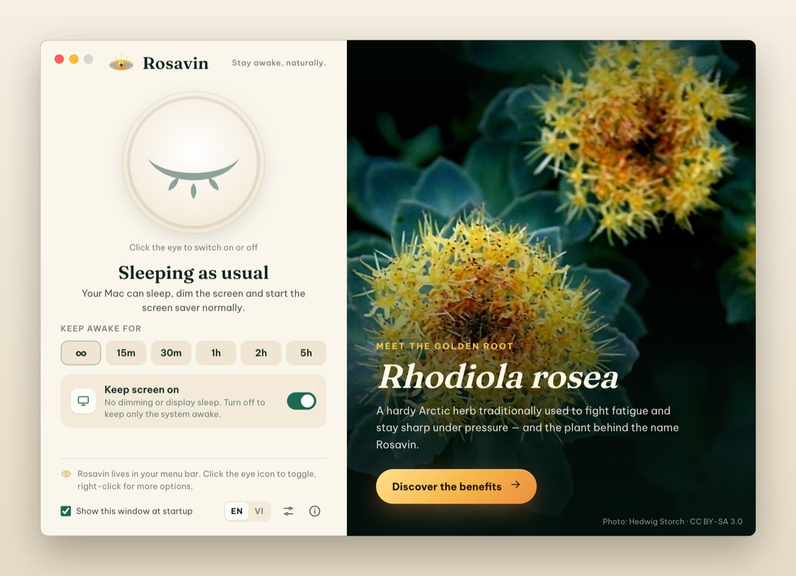
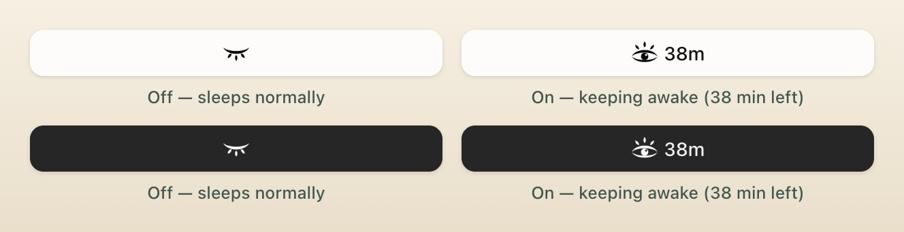
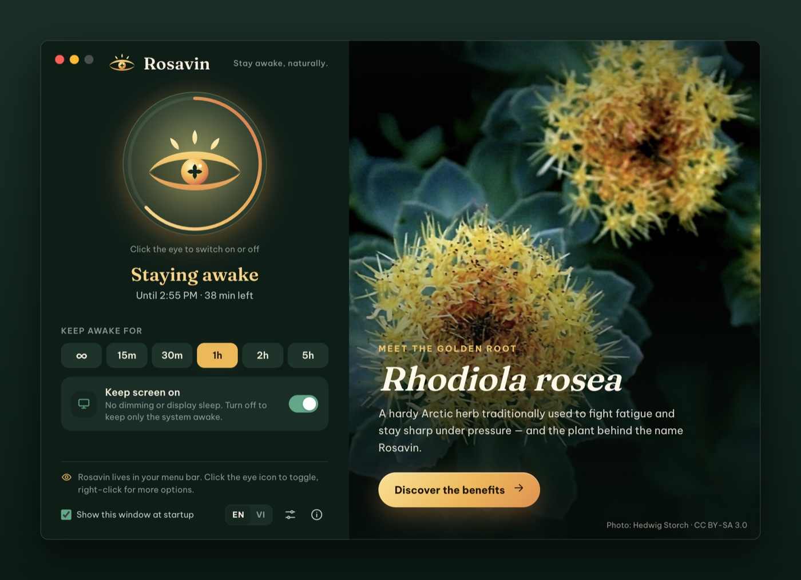
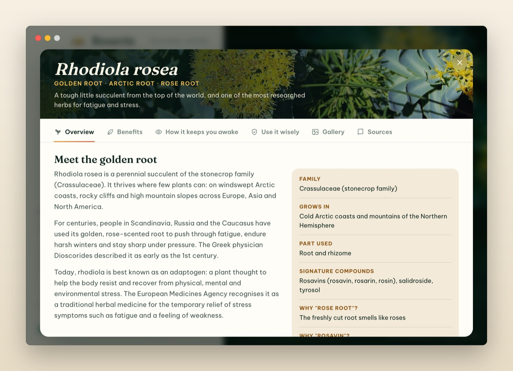
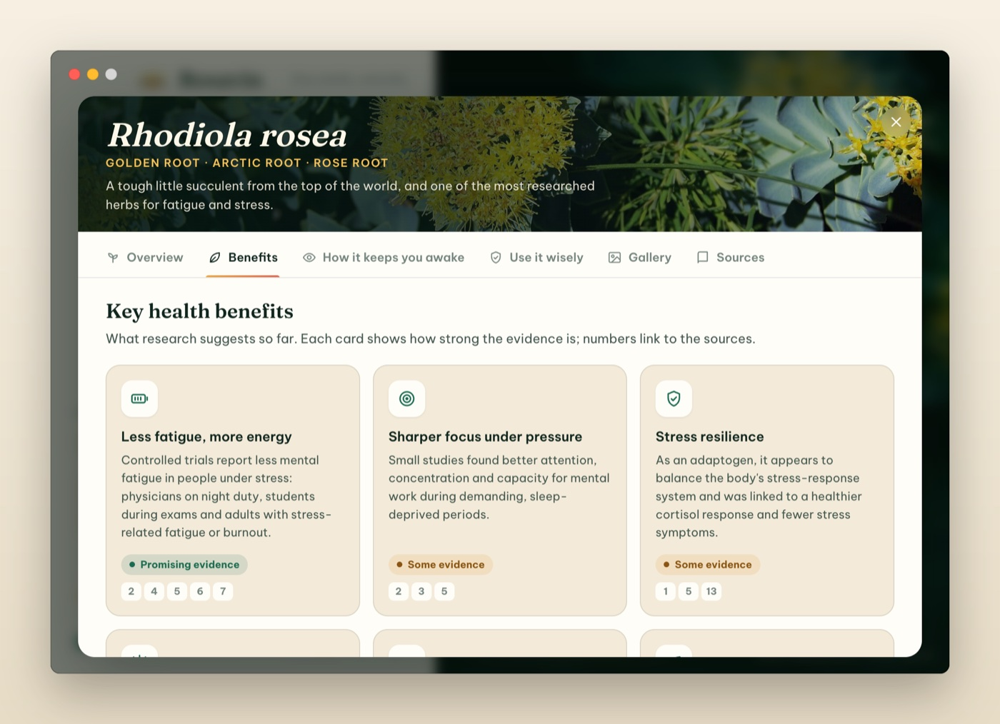
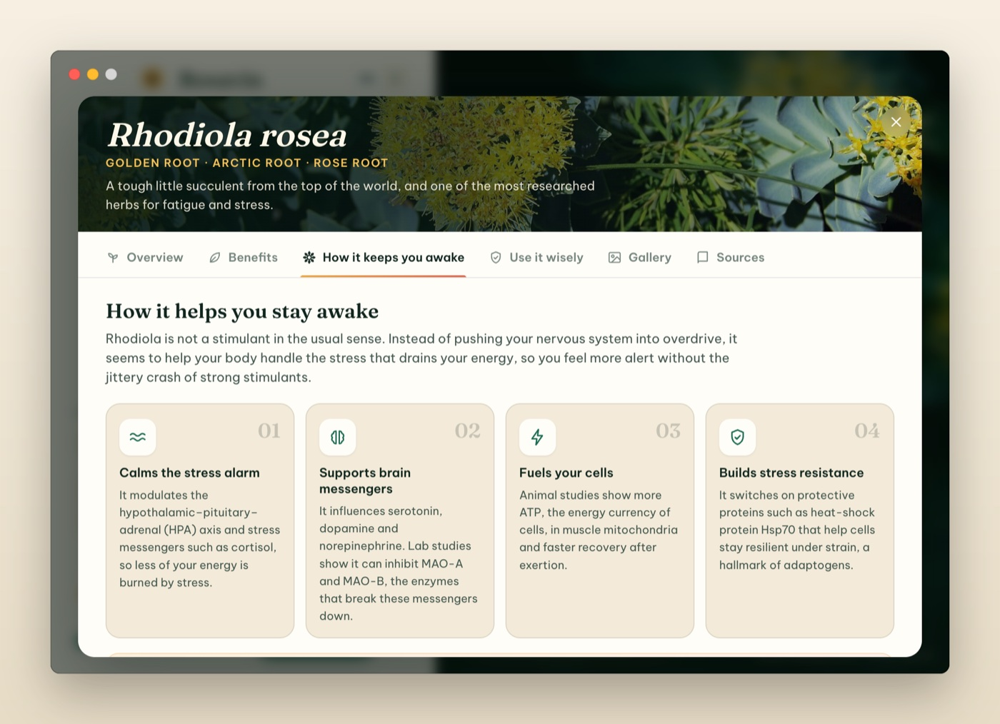
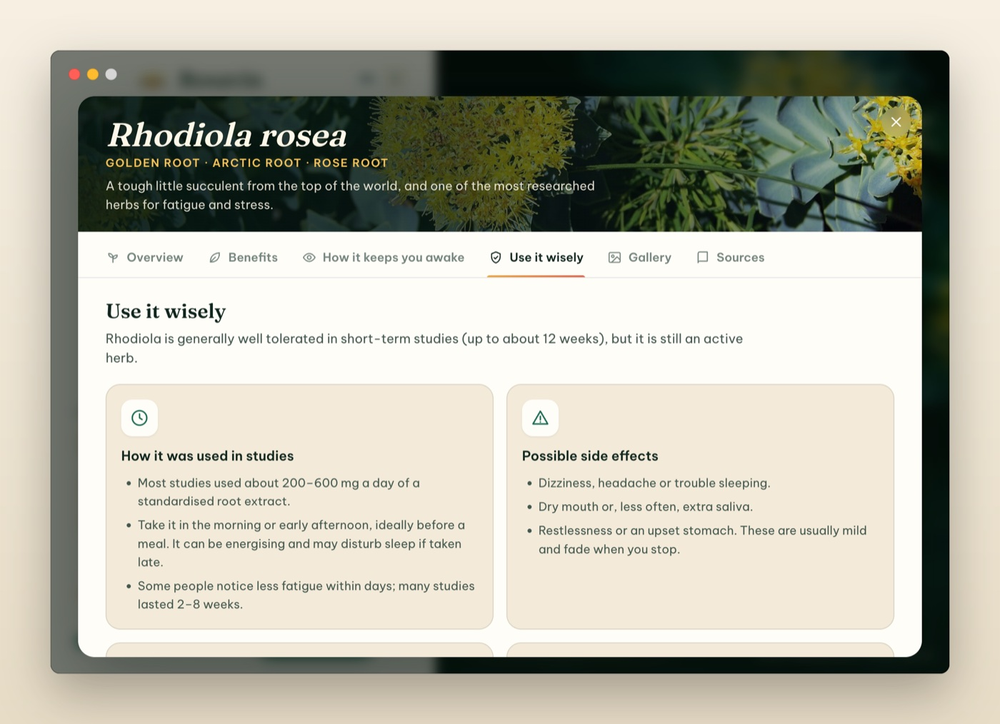
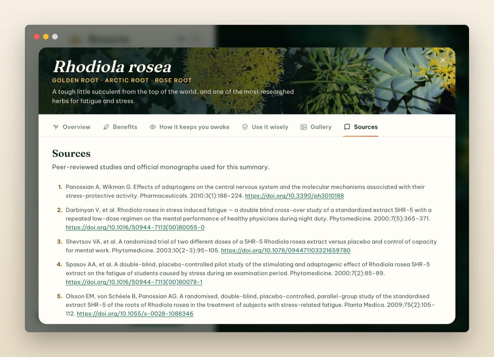
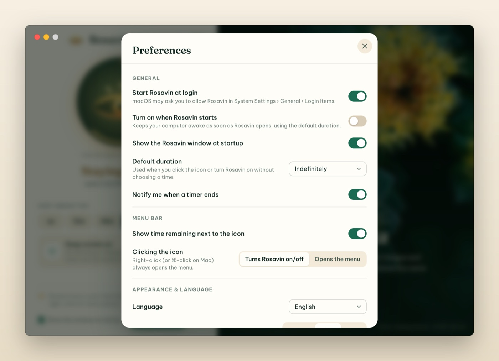
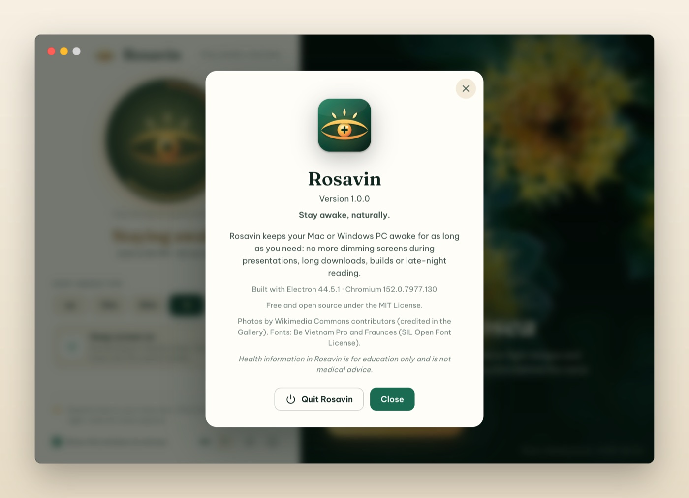

# Rosavin User Guide

**Version 1.0 · macOS 13+ and Windows 10/11** · [Tiếng Việt](USER_GUIDE.vi.md)

Rosavin is a tiny app that keeps your computer awake. It stops your Mac or PC from going to sleep, dimming the screen or starting the screen saver while you are presenting, downloading, building, reading or watching. This guide walks you through every feature, step by step.

## Contents

1. [What Rosavin does](#what-rosavin-does)
2. [Install Rosavin](#install-rosavin)
3. [Your first minute](#your-first-minute)
4. [The menu bar icon](#the-menu-bar-icon)
5. [The Rosavin window](#the-rosavin-window)
6. [Timers](#timers)
7. [Keep screen on, or system only](#keep-screen-on-or-system-only)
8. [Learn about Rhodiola rosea](#learn-about-rhodiola-rosea)
9. [Preferences](#preferences)
10. [Automation: links and command line](#automation-links-and-command-line)
11. [About Rosavin and quitting](#about-rosavin-and-quitting)
12. [Troubleshooting & FAQ](#troubleshooting--faq)
13. [Uninstall](#uninstall)
14. [Privacy and health disclaimer](#privacy-and-health-disclaimer)

## What Rosavin does

Your computer normally dims and then sleeps after a few minutes without keyboard or mouse activity. That is great for saving energy, but annoying when you are giving a talk, following a recipe, watching a long upload or reading. Rosavin pauses that behaviour **only while you want it to**:

- **On:** no sleep, no screen dimming, no screen saver.
- **Off:** your normal energy settings apply again, exactly as before.

Rosavin does not change your system settings; it simply asks macOS or Windows to stay awake while it is on, and releases that request as soon as you switch it off or quit.

## Install Rosavin

### macOS

1. **Choose the right file.** Download one disk image from the project's Releases page:
   - `Rosavin-1.0.0-arm64.dmg`: Apple Silicon Macs (M1, M2, M3, M4…)
   - `Rosavin-1.0.0-x64.dmg`: Intel Macs
   - `Rosavin-1.0.0-universal.dmg`: works on every Mac (larger download)

   Not sure which chip you have? Open the Apple menu › **About This Mac** and look at **Chip** (Apple M…) or **Processor** (Intel).

2. **Open the disk image and drag Rosavin into Applications.**

   

3. **Eject the disk image** (click ⏏ next to "Rosavin 1.0.0" in the Finder sidebar). You can delete the `.dmg` afterwards.

4. **Open Rosavin** from Applications, Launchpad or Spotlight (⌘ Space, type *Rosavin*).

5. **Confirm the first launch.** Rosavin is free and open source and is not notarized by Apple, so macOS asks you to approve it once:
   - **macOS 15 Sequoia or later:** a message says *"Rosavin" Not Opened*. Click **Done**. Open **System Settings › Privacy & Security**, scroll down to the **Security** section, and click **Open Anyway** next to *"Rosavin" was blocked to protect your Mac*. Enter your password (or use Touch ID), then click **Open Anyway** once more.
   - **macOS 13 Ventura / 14 Sonoma:** in the Applications folder, **Control-click** (or right-click) **Rosavin** and choose **Open**, then click **Open** in the dialog.
   - **Alternative (Terminal):** `xattr -dr com.apple.quarantine /Applications/Rosavin.app`

   You only need to do this once. Afterwards Rosavin opens normally.

### Windows

1. Run the installer **Rosavin Setup 1.0.0.exe**.
2. If Microsoft Defender SmartScreen shows *Windows protected your PC*, click **More info › Run anyway** (the installer is not code-signed).
3. Choose the install location (the default is fine) and finish the wizard. Rosavin creates Start menu and desktop shortcuts.
4. Rosavin appears in the **system tray**, next to the clock. If you don't see it, click the **^** arrow to show hidden icons, then drag the eye icon onto the taskbar to keep it visible.

## Your first minute

When Rosavin starts for the first time, its window opens and an **eye icon** appears in the menu bar (top-right of the screen on a Mac) or in the system tray (bottom-right on Windows).



1. Click the big **closed eye** in the window. It opens, glows gold, and Rosavin says **Staying awake**. Your computer will now stay awake.
2. Click it again to switch Rosavin off. The eye closes and your computer sleeps normally again.
3. Close the window whenever you like. **Rosavin keeps running in the menu bar**, so you can control it from there.

> Tip: if you don't want this window every time Rosavin starts, untick **Show this window at startup** at the bottom of the window.

## The menu bar icon

The eye icon shows Rosavin's state at a glance:



| Icon | State |
| --- | --- |
| **Closed eye** with lashes | Off: your computer sleeps normally |
| **Open eye** with three rays | On: your computer stays awake |
| **Open eye + `38m`** | On with a timer; 38 minutes remaining (macOS) |

**What clicking does:**

- **Click** the icon to switch Rosavin on or off (it uses your default duration; see [Preferences](#preferences)).
- **Right-click** the icon (or **⌘-click**, or **Control-click** on a Mac) to open the menu.

On Windows, hover over the tray icon to see the state and remaining time in the tooltip.

### The menu


| Menu item | What it does |
| --- | --- |
| *Rosavin is on — 38 min left* | Status line (not clickable) |
| **Turn On / Turn Off** | Switch Rosavin on or off |
| **Turn On For ›** | Start a session that ends by itself: Indefinitely, 5, 10, 15, 30 minutes, 1, 2, 3, 5 or 8 hours. The running duration has a check mark |
| **Keep Screen On** | Ticked: no dimming or display sleep. Unticked: only the system stays awake (see [below](#keep-screen-on-or-system-only)) |
| **Open Rosavin…** | Open the Rosavin window |
| **Rhodiola Rosea Benefits…** | Open the window directly on the Rhodiola rosea guide |
| **Preferences…** | Open the settings |
| **About Rosavin** | Version and credits |
| **Quit Rosavin** | Close Rosavin completely (your computer then sleeps normally) |

## The Rosavin window

Open the window from the menu (**Open Rosavin…**) or by opening the app again from Applications / the Start menu.


1. **The eye button.** Click it to switch Rosavin on or off. When a timer is running, the golden **ring** around it empties as time passes.
2. **Status.** *Staying awake* with the end time and the time left, for example *Until 2:50 PM · 38 min left*, or *Sleeping as usual* when Rosavin is off.
3. **Keep awake for.** Quick durations: **∞** (until you turn it off), **15m**, **30m**, **1h**, **2h**, **5h**. Click one to start a session right away; click the highlighted one again to stop. When Rosavin is off, your default duration has a thin outline.
4. **Keep screen on.** Choose whether the display stays on, or only the system.
5. **Bottom bar.** A reminder of where the icon lives, the **Show this window at startup** option, the **EN / VI** language switch, **Preferences** (sliders) and **About** (i).
6. **The golden root panel.** A photo of *Rhodiola rosea* and the **Discover the benefits** button.

Rosavin follows your system's light or dark appearance (you can also force one in Preferences):



## Timers

A timer switches Rosavin off automatically, so you never leave your computer awake by accident.

- **From the menu:** right-click the icon › **Turn On For** › choose a duration.
- **From the window:** click a duration chip (15m, 30m, 1h, 2h, 5h).
- **Default duration:** set what a simple click on the icon does in **Preferences › Default duration** (for example *1 hour* instead of *Indefinitely*).

While a timer runs you will see the remaining time next to the menu bar icon (macOS), in the tooltip (Windows), in the menu's status line and in the window. When it ends, Rosavin switches off and shows a notification (*Rosavin is off*). You can turn that notification off in Preferences.

Choosing a new duration while Rosavin is on restarts the timer from now. If your computer is forced to sleep anyway (for example by closing a MacBook lid) and the timer ends meanwhile, Rosavin switches off as soon as the computer wakes up.

## Keep screen on, or system only

| Mode | Use it for | What happens |
| --- | --- | --- |
| **Keep Screen On** (default) | Presentations, reading, recipes, dashboards, video calls | No sleep, no dimming, no screen saver |
| **System only** (Keep Screen On unticked) | Long downloads, uploads, renders, backups, remote sessions | The display may turn off as usual, but the computer keeps running |

Switch modes from the menu (**Keep Screen On**) or with the switch in the window. You can switch while Rosavin is on; the current session and timer continue.

## Learn about Rhodiola rosea

Rosavin is named after **rosavin**, the signature compound of *Rhodiola rosea*, the "golden root" from the Arctic. Click **Discover the benefits** in the window (or choose **Rhodiola Rosea Benefits…** in the menu) to open an illustrated guide with six tabs. Close it with the **×** button or the **Esc** key.

**Overview.** What the plant is, where it grows, its traditional use and key facts, plus an honest note on how strong the science is.



**Benefits.** Six health benefits, each with an evidence badge (*Promising evidence*, *Some evidence*, *Early research*). Click a number such as **2** or **5** to jump to that study in the Sources tab.



**How it keeps you awake.** The four ways rhodiola is thought to fight fatigue (calming the stress response, supporting brain messengers, fuelling cells, building stress resistance), the molecules behind it, and a reminder that nothing replaces sleep.



**Use it wisely.** How it was taken in studies, possible side effects, who should talk to a doctor first, and how to choose a quality product, followed by the medical disclaimer.



**Gallery.** Photos of *Rhodiola rosea* in the wild. Click a photo to enlarge it; click the credit line to open the original on Wikimedia Commons.


**Sources.** The 19 peer-reviewed studies and official monographs behind the summary. Click a link to open it in your browser.



## Preferences

Open Preferences with the sliders button in the window, **Preferences…** in the menu, or **⌘,** (Ctrl+, on Windows). Changes apply immediately.



| Setting | What it does |
| --- | --- |
| **Start Rosavin at login** | Rosavin starts automatically (quietly, in the menu bar) when you log in. On macOS you may need to allow it in *System Settings › General › Login Items* |
| **Turn on when Rosavin starts** | Rosavin switches itself on every time it starts, using the default duration |
| **Show the Rosavin window at startup** | Open the window when Rosavin starts (same as the checkbox at the bottom of the window) |
| **Default duration** | What clicking the icon (or *Turn On*) does: *Indefinitely* or a time from 5 minutes to 8 hours |
| **Notify me when a timer ends** | Show a notification when a timed session finishes |
| **Show time remaining next to the icon** | macOS only: show `38m`-style countdowns in the menu bar |
| **Clicking the icon** | *Turns Rosavin on/off* (default) or *Opens the menu*. Right-click always opens the menu |
| **Language** | *System default*, *English* or *Tiếng Việt*. You can also use the **EN / VI** switch in the window |
| **Theme** | *System*, *Light* or *Dark* |

## Automation: links and command line

Power users can control Rosavin from scripts, the macOS **Shortcuts** app, Alfred/Raycast, or a terminal.

**Links** (type them in Terminal with `open`, or use them in Shortcuts' *Open URLs* action):

| Link | Action |
| --- | --- |
| `rosavin://activate` | Turn on (default duration) |
| `rosavin://activate?minutes=45` | Turn on for 45 minutes (0 = indefinitely) |
| `rosavin://deactivate` | Turn off |
| `rosavin://toggle` | Switch on/off |
| `rosavin://show` | Open the window |
| `rosavin://benefits` | Open the Rhodiola rosea guide |
| `rosavin://preferences` | Open Preferences |

```bash
open "rosavin://activate?minutes=45"     # macOS
start rosavin://deactivate               # Windows
```

**Command line:** the same actions as flags, e.g. `--activate=30`, `--deactivate`, `--toggle`, `--show`. Add `--hidden` to start Rosavin without its window. If Rosavin is already running, the command is passed to the running app.

```bash
/Applications/Rosavin.app/Contents/MacOS/Rosavin --activate=30
```

## About Rosavin and quitting

Click **(i)** in the window or choose **About Rosavin** in the menu to see the version, licence and credits.



To quit, choose **Quit Rosavin** in the menu, click **Quit Rosavin** in the About box, or press **⌘Q** while the window is active. Quitting always releases the keep-awake request.

## Troubleshooting & FAQ

**I can't see the eye icon in the menu bar.**
On MacBooks with a notch, menu bar icons can hide behind it when the menu bar is crowded. Quit a few menu bar apps or use a smaller font size for menu bar items. If you use a menu bar organiser (such as Bartender or Ice), check its hidden section. You can always open Rosavin's window from Applications.

**My MacBook still sleeps when I close the lid.**
That is a macOS rule for every app: a MacBook sleeps when its lid is closed unless it is connected to power and an external display. Keep the lid open, or use clamshell mode.

**The screen still turns off.**
Make sure **Keep Screen On** is ticked. In *system only* mode the display may sleep while the computer keeps running.

**How can I check that Rosavin is working?**
- macOS: in Terminal, run `pmset -g assertions` and look for a line with `Rosavin` (`NoDisplaySleepAssertion`, or `NoIdleSleepAssertion` in system-only mode).
- Windows: in an administrator terminal, run `powercfg /requests` and look for Rosavin under *DISPLAY* or *SYSTEM*.

**"Rosavin can't be opened" / "Not Opened" on first launch.**
Follow step 5 of the [macOS install](#macos) section. This only happens once.

**I don't get a notification when the timer ends.**
Allow notifications for Rosavin in *System Settings › Notifications* (macOS) or *Settings › System › Notifications* (Windows), and check that **Notify me when a timer ends** is on.

**"Start Rosavin at login" switches itself off.**
Rosavin reads the real login-item state from the system. On macOS, open *System Settings › General › Login Items* and make sure Rosavin is allowed.

**Does Rosavin drain my battery?**
Rosavin itself uses almost no energy. Keeping the display on does use power, so use a timer or system-only mode when you're on battery.

## Uninstall

- **macOS:** quit Rosavin, then drag **Rosavin** from Applications to the Trash. To remove its settings too, delete `~/Library/Application Support/Rosavin`. If you enabled *Start at login*, turn it off first (or remove Rosavin from *System Settings › General › Login Items*).
- **Windows:** *Settings › Apps › Installed apps › Rosavin › Uninstall*. Settings are stored in `%APPDATA%\Rosavin`.

## Privacy and health disclaimer

**Privacy.** Rosavin works fully offline: no accounts, no analytics, no network requests. Your preferences are saved only on your computer.

**Health information.** The Rhodiola rosea content in Rosavin is for general education only and is not medical advice. Supplements are not approved to diagnose, treat, cure or prevent any disease. Talk to a qualified healthcare professional before taking any supplement, especially if you are pregnant, breastfeeding, taking medication or living with a health condition.

*Rosavin is free and open source software under the MIT License. Photos of Rhodiola rosea by Wikimedia Commons contributors; see CREDITS.md.*
