# Hướng dẫn sử dụng Rosavin

**Phiên bản 1.0 · macOS 13 trở lên và Windows 10/11** · [English](USER_GUIDE.en.md)

Rosavin là một ứng dụng nhỏ gọn giúp máy tính của bạn luôn thức. Ứng dụng ngăn máy Mac hoặc PC tự ngủ, tự giảm độ sáng màn hình hay bật trình bảo vệ màn hình trong lúc bạn thuyết trình, tải tệp, build dự án, đọc tài liệu hoặc xem video. Tài liệu này hướng dẫn chi tiết từng tính năng, từng bước một.

## Mục lục

1. [Rosavin làm gì](#rosavin-làm-gì)
2. [Cài đặt Rosavin](#cài-đặt-rosavin)
3. [Phút đầu tiên](#phút-đầu-tiên)
4. [Biểu tượng trên thanh menu](#biểu-tượng-trên-thanh-menu)
5. [Cửa sổ Rosavin](#cửa-sổ-rosavin)
6. [Hẹn giờ](#hẹn-giờ)
7. [Giữ màn hình sáng hay chỉ giữ hệ thống](#giữ-màn-hình-sáng-hay-chỉ-giữ-hệ-thống)
8. [Tìm hiểu về Rhodiola rosea](#tìm-hiểu-về-rhodiola-rosea)
9. [Tùy chọn](#tùy-chọn)
10. [Tự động hóa: liên kết và dòng lệnh](#tự-động-hóa-liên-kết-và-dòng-lệnh)
11. [Giới thiệu Rosavin và thoát ứng dụng](#giới-thiệu-rosavin-và-thoát-ứng-dụng)
12. [Khắc phục sự cố & câu hỏi thường gặp](#khắc-phục-sự-cố--câu-hỏi-thường-gặp)
13. [Gỡ cài đặt](#gỡ-cài-đặt)
14. [Quyền riêng tư và lưu ý sức khỏe](#quyền-riêng-tư-và-lưu-ý-sức-khỏe)

## Rosavin làm gì

Bình thường, máy tính sẽ giảm độ sáng rồi đi ngủ sau vài phút không có thao tác bàn phím hay chuột. Điều đó giúp tiết kiệm điện, nhưng lại phiền khi bạn đang thuyết trình, xem công thức nấu ăn, chờ tải lên một tệp lớn hay đọc tài liệu. Rosavin tạm dừng hành vi đó **chỉ trong khoảng thời gian bạn muốn**:

- **Bật:** máy không ngủ, màn hình không tối đi, không bật trình bảo vệ màn hình.
- **Tắt:** mọi thiết lập tiết kiệm năng lượng của bạn hoạt động trở lại y như cũ.

Rosavin không thay đổi cài đặt hệ thống. Ứng dụng chỉ yêu cầu macOS hoặc Windows giữ máy thức trong lúc Rosavin đang bật, và gỡ bỏ yêu cầu đó ngay khi bạn tắt hoặc thoát ứng dụng.

## Cài đặt Rosavin

### macOS

1. **Chọn đúng tệp.** Tải một tệp ảnh đĩa (DMG) từ trang Releases của dự án:
   - `Rosavin-1.0.0-arm64.dmg`: máy Mac dùng chip Apple Silicon (M1, M2, M3, M4…)
   - `Rosavin-1.0.0-x64.dmg`: máy Mac dùng chip Intel
   - `Rosavin-1.0.0-universal.dmg`: chạy trên mọi máy Mac (dung lượng lớn hơn)

   Không chắc máy mình dùng chip gì? Mở menu Apple › **Giới thiệu về máy Mac này** và xem dòng **Chip** (Apple M…) hoặc **Bộ xử lý** (Intel).

2. **Mở tệp DMG rồi kéo Rosavin vào thư mục Applications (Ứng dụng).**

   

3. **Tháo ảnh đĩa** (nhấn nút ⏏ cạnh "Rosavin 1.0.0" ở thanh bên của Finder). Sau đó bạn có thể xóa tệp `.dmg`.

4. **Mở Rosavin** từ thư mục Ứng dụng, Launchpad hoặc Spotlight (⌘ Space, gõ *Rosavin*).

5. **Xác nhận lần mở đầu tiên.** Rosavin là phần mềm miễn phí, mã nguồn mở và chưa được Apple công chứng (notarize), nên macOS sẽ yêu cầu bạn cho phép một lần:
   - **macOS 15 Sequoia trở lên:** khi thấy thông báo *Không mở "Rosavin"*, nhấn **Xong**. Mở **Cài đặt hệ thống › Quyền riêng tư & Bảo mật**, cuộn xuống mục **Bảo mật** và nhấn **Vẫn mở** cạnh dòng *"Rosavin" đã bị chặn…*. Nhập mật khẩu (hoặc dùng Touch ID), rồi nhấn **Vẫn mở** thêm một lần nữa.
   - **macOS 13 Ventura / 14 Sonoma:** trong thư mục Ứng dụng, **Control-nhấn** (hoặc nhấn chuột phải) vào **Rosavin**, chọn **Mở**, rồi nhấn **Mở** trong hộp thoại.
   - **Cách khác (Terminal):** `xattr -dr com.apple.quarantine /Applications/Rosavin.app`

   Bạn chỉ cần làm việc này một lần. Từ lần sau Rosavin mở bình thường.

### Windows

1. Chạy trình cài đặt **Rosavin Setup 1.0.0.exe**.
2. Nếu Microsoft Defender SmartScreen hiện *Windows đã bảo vệ PC của bạn*, nhấn **Thông tin thêm › Vẫn chạy** (trình cài đặt chưa được ký số).
3. Chọn thư mục cài đặt (để mặc định là được) và hoàn tất. Rosavin tạo lối tắt ở menu Start và màn hình nền.
4. Rosavin xuất hiện ở **khay hệ thống**, cạnh đồng hồ. Nếu không thấy, nhấn mũi tên **^** để hiện các biểu tượng ẩn, rồi kéo biểu tượng con mắt ra thanh tác vụ để luôn nhìn thấy.

## Phút đầu tiên

Khi Rosavin khởi động lần đầu, cửa sổ ứng dụng sẽ mở ra và một **biểu tượng con mắt** xuất hiện trên thanh menu (góc trên bên phải màn hình Mac) hoặc ở khay hệ thống (góc dưới bên phải trên Windows).

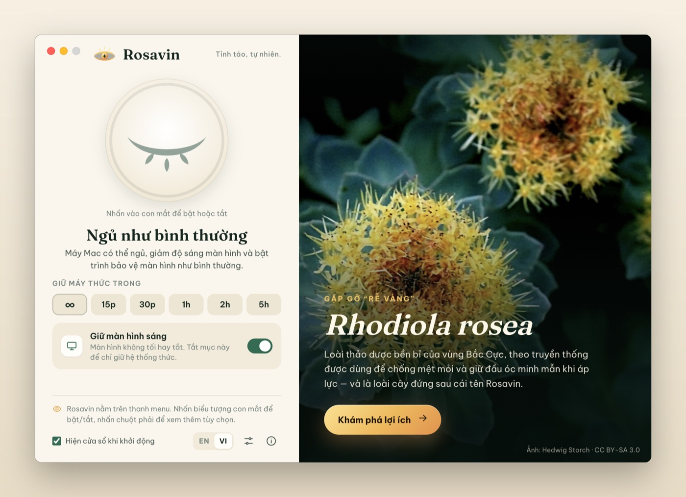

1. Nhấn vào **con mắt đang nhắm** thật lớn trong cửa sổ. Con mắt mở ra, sáng ánh vàng và Rosavin báo **Đang giữ máy thức**. Từ giờ máy tính sẽ luôn thức.
2. Nhấn lần nữa để tắt Rosavin. Con mắt nhắm lại và máy tính ngủ bình thường trở lại.
3. Bạn có thể đóng cửa sổ bất cứ lúc nào. **Rosavin vẫn chạy trên thanh menu**, bạn điều khiển nó từ đó.

> Mẹo: nếu không muốn cửa sổ này hiện mỗi khi Rosavin khởi động, hãy bỏ chọn **Hiện cửa sổ khi khởi động** ở cuối cửa sổ.

## Biểu tượng trên thanh menu

Chỉ cần nhìn biểu tượng con mắt là biết trạng thái của Rosavin:

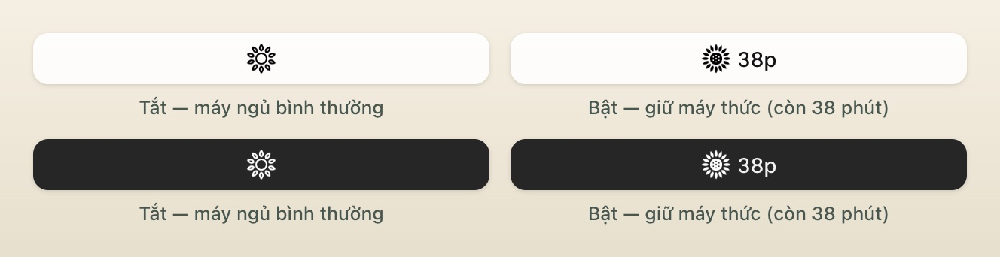

| Biểu tượng | Trạng thái |
| --- | --- |
| **Mắt nhắm** có hàng mi | Tắt: máy tính ngủ bình thường |
| **Mắt mở** có ba tia sáng | Bật: máy tính luôn thức |
| **Mắt mở + `38p`** | Bật có hẹn giờ, còn 38 phút (macOS) |

**Thao tác nhấn chuột:**

- **Nhấn** vào biểu tượng để bật hoặc tắt Rosavin (dùng thời lượng mặc định, xem [Tùy chọn](#tùy-chọn)).
- **Nhấn chuột phải** vào biểu tượng (hoặc **⌘-nhấn**, hay **Control-nhấn** trên Mac) để mở menu.

Trên Windows, đưa chuột lên biểu tượng ở khay hệ thống để xem trạng thái và thời gian còn lại.

### Menu

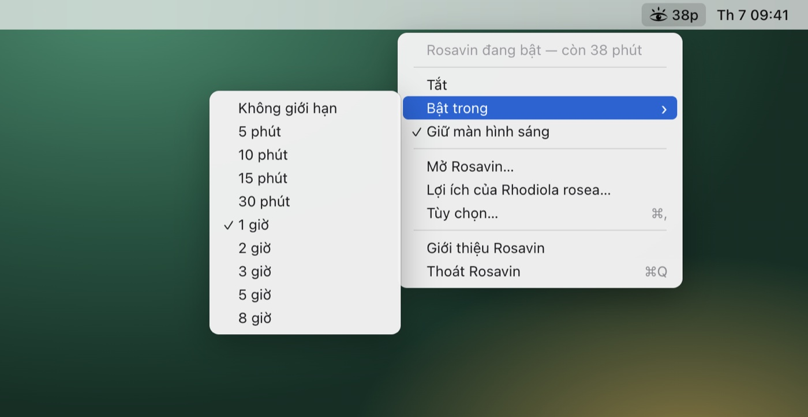

| Mục menu | Chức năng |
| --- | --- |
| *Rosavin đang bật — còn 38 phút* | Dòng trạng thái (không nhấn được) |
| **Bật / Tắt** | Bật hoặc tắt Rosavin |
| **Bật trong ›** | Bắt đầu một phiên tự kết thúc: Không giới hạn, 5, 10, 15, 30 phút, 1, 2, 3, 5 hoặc 8 giờ. Thời lượng đang chạy có dấu tích |
| **Giữ màn hình sáng** | Có dấu tích: màn hình không tối đi hay tắt. Không có dấu tích: chỉ giữ hệ thống thức (xem [bên dưới](#giữ-màn-hình-sáng-hay-chỉ-giữ-hệ-thống)) |
| **Mở Rosavin…** | Mở cửa sổ Rosavin |
| **Lợi ích của Rhodiola rosea…** | Mở thẳng phần giới thiệu Rhodiola rosea |
| **Tùy chọn…** | Mở phần cài đặt |
| **Giới thiệu Rosavin** | Phiên bản và thông tin ghi công |
| **Thoát Rosavin** | Đóng hẳn Rosavin (máy tính sẽ ngủ bình thường) |

## Cửa sổ Rosavin

Mở cửa sổ từ menu (**Mở Rosavin…**) hoặc mở lại ứng dụng từ thư mục Ứng dụng / menu Start.

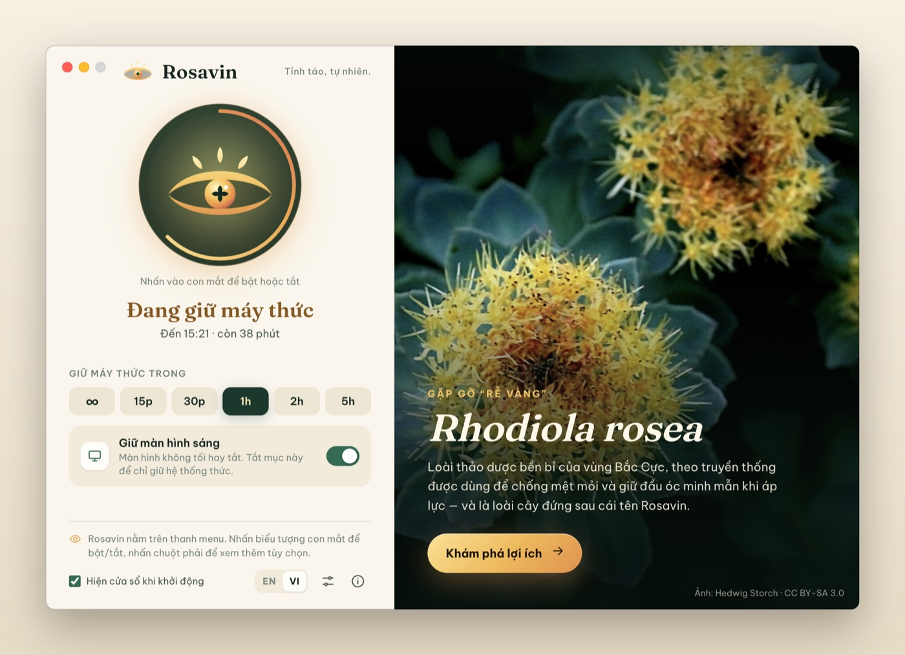

1. **Nút con mắt.** Nhấn để bật hoặc tắt Rosavin. Khi có hẹn giờ, **vòng tròn vàng** quanh con mắt sẽ ngắn dần theo thời gian.
2. **Trạng thái.** *Đang giữ máy thức* kèm giờ kết thúc và thời gian còn lại, ví dụ *Đến 14:53 · còn 38 phút*; hoặc *Ngủ như bình thường* khi Rosavin tắt.
3. **Giữ máy thức trong.** Các thời lượng nhanh: **∞** (cho đến khi bạn tắt), **15p**, **30p**, **1h**, **2h**, **5h**. Nhấn một nút để bắt đầu ngay; nhấn lại nút đang sáng để dừng. Khi Rosavin tắt, thời lượng mặc định có viền mảnh.
4. **Giữ màn hình sáng.** Chọn giữ cả màn hình sáng, hay chỉ giữ hệ thống thức.
5. **Thanh dưới cùng.** Lời nhắc vị trí biểu tượng, tùy chọn **Hiện cửa sổ khi khởi động**, nút chuyển ngôn ngữ **EN / VI**, nút **Tùy chọn** (biểu tượng thanh trượt) và **Giới thiệu** (i).
6. **Khung "rễ vàng".** Ảnh cây *Rhodiola rosea* và nút **Khám phá lợi ích**.

Rosavin tự đổi theo giao diện sáng/tối của hệ thống (bạn cũng có thể chọn cố định trong Tùy chọn):

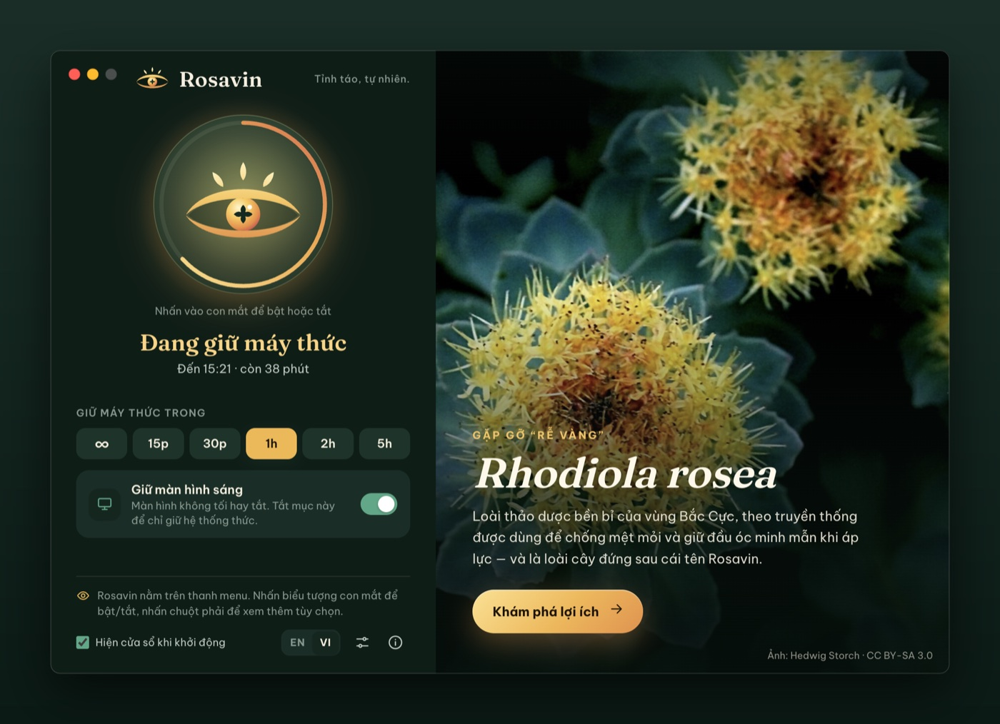

## Hẹn giờ

Hẹn giờ giúp Rosavin tự tắt, để bạn không bao giờ lỡ để máy thức cả đêm.

- **Từ menu:** nhấn chuột phải vào biểu tượng › **Bật trong** › chọn thời lượng.
- **Từ cửa sổ:** nhấn một nút thời lượng (15p, 30p, 1h, 2h, 5h).
- **Thời lượng mặc định:** chọn điều sẽ xảy ra khi bạn chỉ nhấn vào biểu tượng trong **Tùy chọn › Thời lượng mặc định** (ví dụ *1 giờ* thay vì *Không giới hạn*).

Khi đang hẹn giờ, thời gian còn lại hiện cạnh biểu tượng trên thanh menu (macOS), trong chú thích khi rê chuột (Windows), ở dòng trạng thái của menu và trong cửa sổ. Khi hết giờ, Rosavin tự tắt và hiện thông báo (*Rosavin đã tắt*). Bạn có thể tắt thông báo này trong Tùy chọn.

Chọn thời lượng mới khi Rosavin đang bật sẽ bắt đầu lại hẹn giờ từ lúc đó. Nếu máy vẫn bị buộc phải ngủ (ví dụ khi gập nắp MacBook) và hẹn giờ kết thúc trong lúc ngủ, Rosavin sẽ tắt ngay khi máy thức dậy.

## Giữ màn hình sáng hay chỉ giữ hệ thống

| Chế độ | Phù hợp khi | Điều gì xảy ra |
| --- | --- | --- |
| **Giữ màn hình sáng** (mặc định) | Thuyết trình, đọc tài liệu, xem công thức, theo dõi dashboard, gọi video | Máy không ngủ, màn hình không tối, không bật trình bảo vệ màn hình |
| **Chỉ giữ hệ thống** (bỏ chọn Giữ màn hình sáng) | Tải xuống/tải lên tệp lớn, render video, sao lưu, điều khiển từ xa | Màn hình có thể tắt như thường lệ, nhưng máy tính vẫn chạy |

Đổi chế độ từ menu (**Giữ màn hình sáng**) hoặc bằng công tắc trong cửa sổ. Bạn có thể đổi ngay cả khi Rosavin đang bật; phiên và hẹn giờ hiện tại vẫn tiếp tục.

## Tìm hiểu về Rhodiola rosea

Rosavin được đặt theo tên **rosavin**, hoạt chất đặc trưng của *Rhodiola rosea* (hồng cảnh thiên), loài "rễ vàng" của vùng Bắc Cực. Nhấn **Khám phá lợi ích** trong cửa sổ (hoặc chọn **Lợi ích của Rhodiola rosea…** trong menu) để mở phần giới thiệu có minh họa, gồm sáu thẻ. Đóng lại bằng nút **×** hoặc phím **Esc**.

**Tổng quan.** Loài cây này là gì, mọc ở đâu, được dùng theo truyền thống ra sao và các thông tin chính.

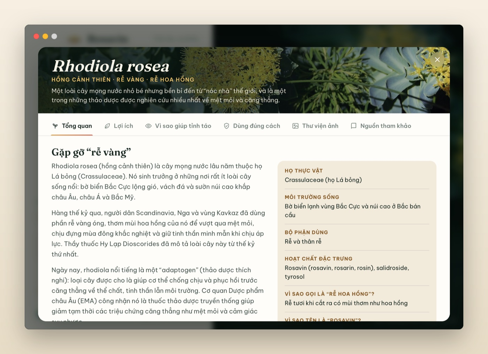

**Lợi ích.** Sáu lợi ích sức khỏe, mỗi lợi ích có nhãn mức bằng chứng (*Bằng chứng khả quan*, *Có một số bằng chứng*, *Nghiên cứu ban đầu*). Nhấn vào số như **2** hoặc **5** để chuyển đến nghiên cứu tương ứng trong thẻ Nguồn tham khảo.

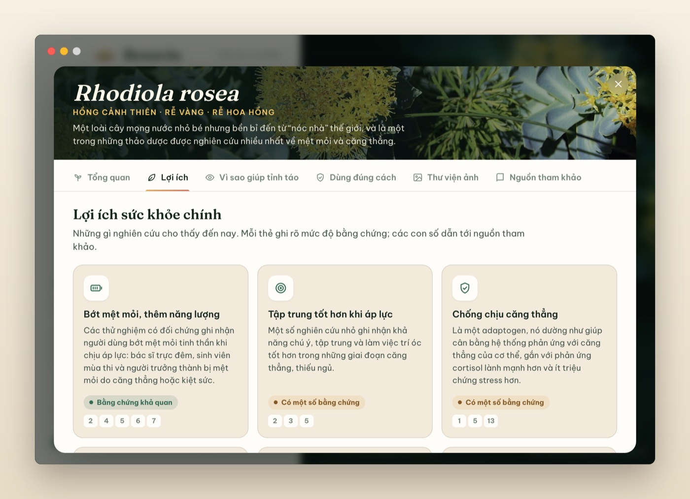

**Vì sao giúp tỉnh táo.** Bốn cơ chế giúp rhodiola chống mệt mỏi (làm dịu phản ứng căng thẳng, hỗ trợ chất dẫn truyền thần kinh, tiếp năng lượng cho tế bào, tăng sức đề kháng với stress), các phân tử đứng sau, và lời nhắc rằng không gì thay thế được giấc ngủ.

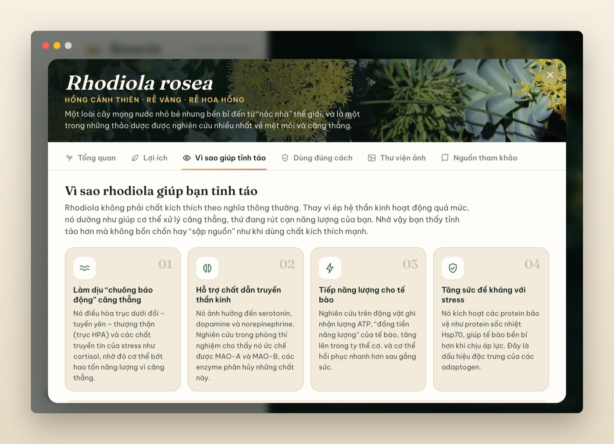

**Dùng đúng cách.** Cách dùng trong các nghiên cứu, tác dụng phụ có thể gặp, ai nên hỏi ý kiến bác sĩ trước, cách chọn sản phẩm chất lượng, và lưu ý y khoa.

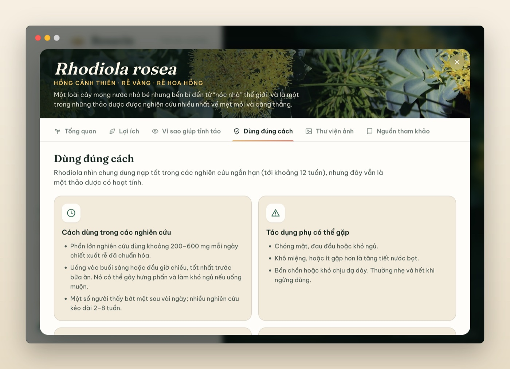

**Thư viện ảnh.** Ảnh *Rhodiola rosea* ngoài tự nhiên. Nhấn vào ảnh để phóng to; nhấn dòng ghi công để mở ảnh gốc trên Wikimedia Commons.

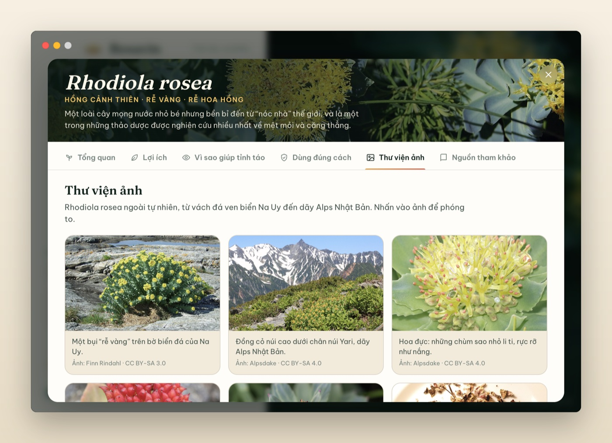

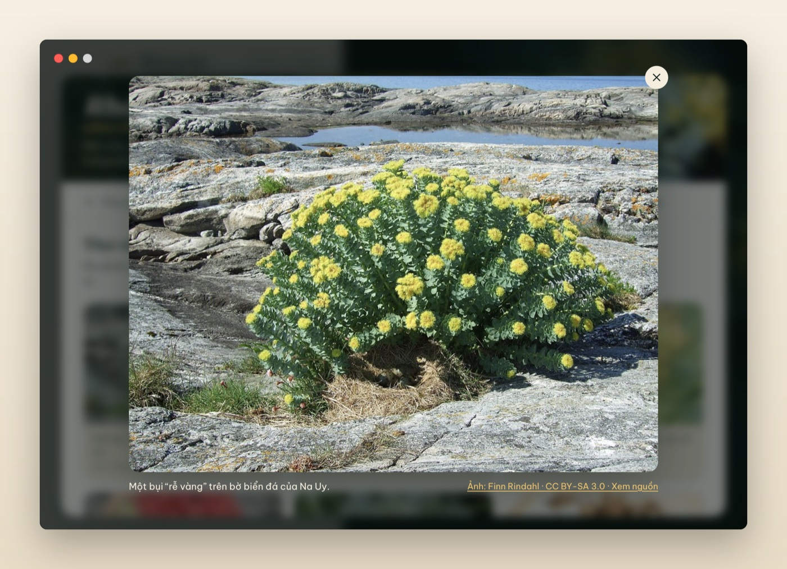

**Nguồn tham khảo.** 19 nghiên cứu được bình duyệt và chuyên luận chính thức làm cơ sở cho phần tóm tắt. Nhấn vào liên kết để mở trong trình duyệt.

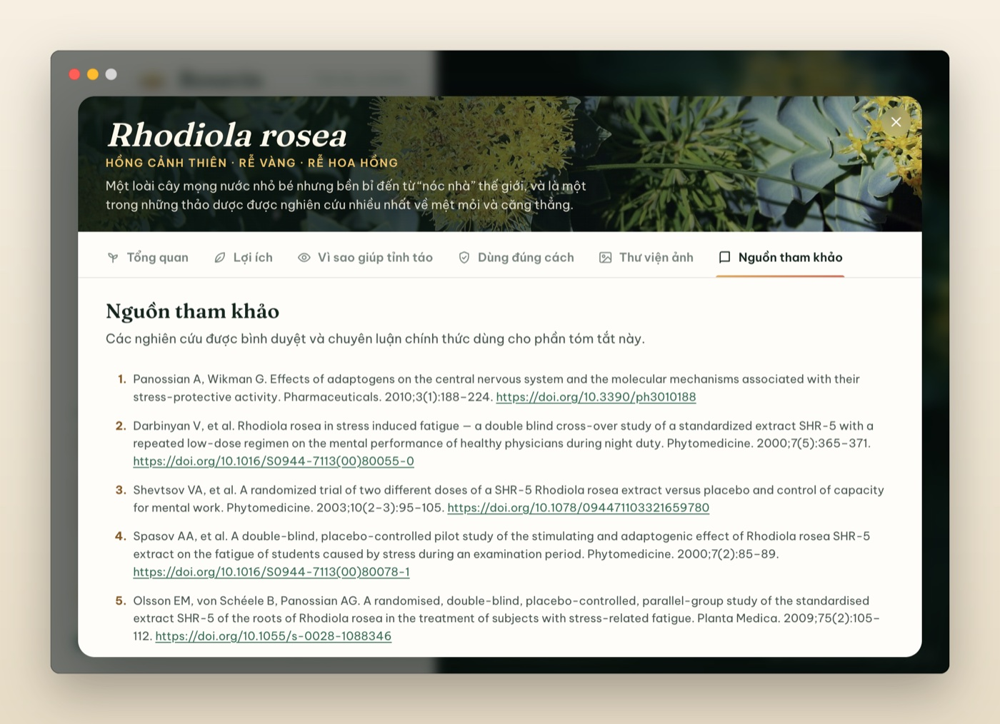

## Tùy chọn

Mở Tùy chọn bằng nút thanh trượt trong cửa sổ, mục **Tùy chọn…** trong menu, hoặc phím **⌘,** (Ctrl+, trên Windows). Thay đổi có hiệu lực ngay.

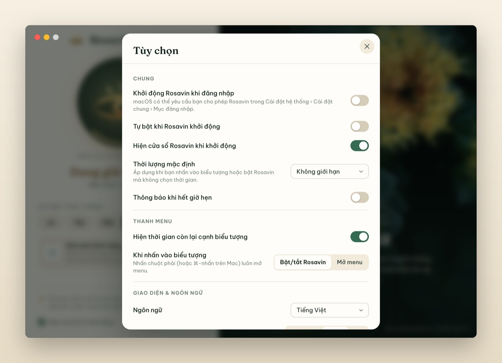

| Cài đặt | Chức năng |
| --- | --- |
| **Khởi động Rosavin khi đăng nhập** | Rosavin tự khởi động (lặng lẽ trên thanh menu) khi bạn đăng nhập. Trên macOS có thể cần cho phép trong *Cài đặt hệ thống › Cài đặt chung › Mục đăng nhập* |
| **Tự bật khi Rosavin khởi động** | Rosavin tự bật mỗi khi khởi động, với thời lượng mặc định |
| **Hiện cửa sổ Rosavin khi khởi động** | Mở cửa sổ khi Rosavin khởi động (giống ô chọn ở cuối cửa sổ) |
| **Thời lượng mặc định** | Điều xảy ra khi nhấn vào biểu tượng (hoặc *Bật*): *Không giới hạn* hoặc từ 5 phút đến 8 giờ |
| **Thông báo khi hết giờ hẹn** | Hiện thông báo khi một phiên hẹn giờ kết thúc |
| **Hiện thời gian còn lại cạnh biểu tượng** | Chỉ trên macOS: hiện đồng hồ đếm ngược kiểu `38p` trên thanh menu |
| **Khi nhấn vào biểu tượng** | *Bật/tắt Rosavin* (mặc định) hoặc *Mở menu*. Nhấn chuột phải luôn mở menu |
| **Ngôn ngữ** | *Theo hệ thống*, *English* hoặc *Tiếng Việt*. Bạn cũng có thể dùng nút **EN / VI** trong cửa sổ |
| **Chủ đề** | *Hệ thống*, *Sáng* hoặc *Tối* |

## Tự động hóa: liên kết và dòng lệnh

Người dùng nâng cao có thể điều khiển Rosavin từ script, ứng dụng **Phím tắt** (Shortcuts) của macOS, Alfred/Raycast hoặc Terminal.

**Liên kết** (gõ trong Terminal với lệnh `open`, hoặc dùng trong tác vụ *Mở URL* của Phím tắt):

| Liên kết | Hành động |
| --- | --- |
| `rosavin://activate` | Bật (thời lượng mặc định) |
| `rosavin://activate?minutes=45` | Bật trong 45 phút (0 = không giới hạn) |
| `rosavin://deactivate` | Tắt |
| `rosavin://toggle` | Bật/tắt |
| `rosavin://show` | Mở cửa sổ |
| `rosavin://benefits` | Mở phần giới thiệu Rhodiola rosea |
| `rosavin://preferences` | Mở Tùy chọn |

```bash
open "rosavin://activate?minutes=45"     # macOS
start rosavin://deactivate               # Windows
```

**Dòng lệnh:** các hành động tương tự dưới dạng tham số, ví dụ `--activate=30`, `--deactivate`, `--toggle`, `--show`. Thêm `--hidden` để khởi động Rosavin mà không mở cửa sổ. Nếu Rosavin đang chạy, lệnh sẽ được chuyển cho ứng dụng đang chạy.

```bash
/Applications/Rosavin.app/Contents/MacOS/Rosavin --activate=30
```

## Giới thiệu Rosavin và thoát ứng dụng

Nhấn **(i)** trong cửa sổ hoặc chọn **Giới thiệu Rosavin** trong menu để xem phiên bản, giấy phép và thông tin ghi công.

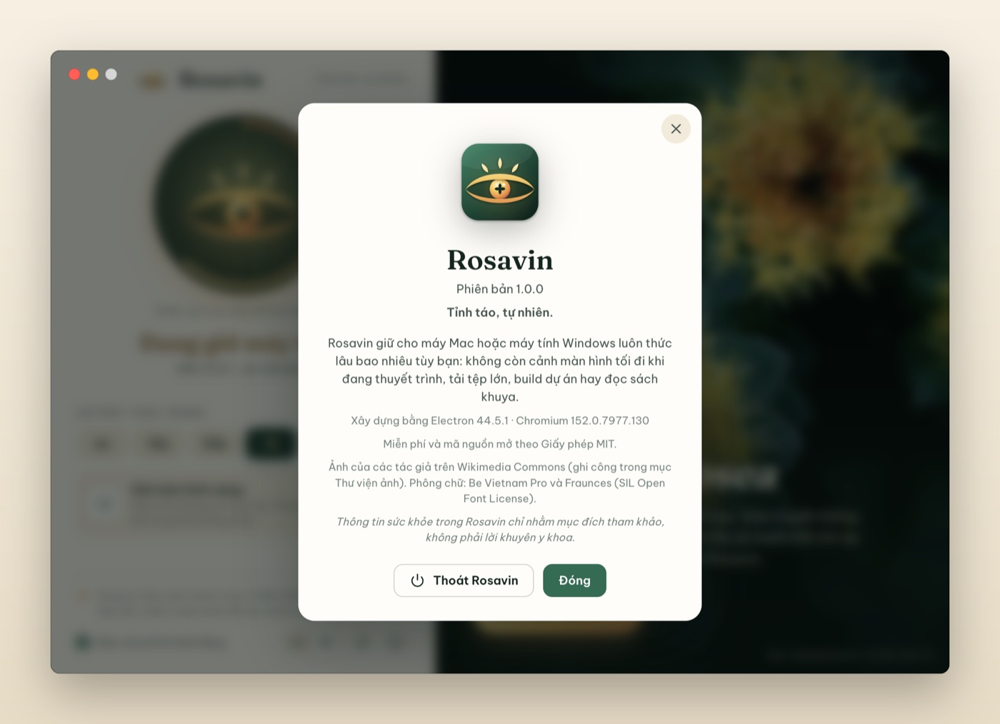

Để thoát, chọn **Thoát Rosavin** trong menu, nhấn **Thoát Rosavin** trong hộp Giới thiệu, hoặc nhấn **⌘Q** khi cửa sổ đang được chọn. Khi thoát, Rosavin luôn gỡ bỏ yêu cầu giữ máy thức.

## Khắc phục sự cố & câu hỏi thường gặp

**Tôi không thấy biểu tượng con mắt trên thanh menu.**
Trên MacBook có "tai thỏ", các biểu tượng có thể bị che khi thanh menu quá đông. Hãy thoát bớt vài ứng dụng trên thanh menu. Nếu bạn dùng ứng dụng sắp xếp thanh menu (như Bartender hay Ice), hãy kiểm tra phần biểu tượng bị ẩn. Bạn luôn có thể mở cửa sổ Rosavin từ thư mục Ứng dụng.

**MacBook vẫn ngủ khi tôi gập nắp.**
Đây là quy tắc của macOS với mọi ứng dụng: MacBook sẽ ngủ khi gập nắp, trừ khi đang cắm sạc và nối màn hình ngoài. Hãy để nắp mở, hoặc dùng chế độ gập nắp với màn hình ngoài.

**Màn hình vẫn tắt.**
Hãy chắc chắn mục **Giữ màn hình sáng** đang được chọn. Ở chế độ *chỉ giữ hệ thống*, màn hình có thể tắt trong khi máy tính vẫn chạy.

**Làm sao kiểm tra Rosavin có đang hoạt động không?**
- macOS: mở Terminal, chạy `pmset -g assertions` và tìm dòng có chữ `Rosavin` (`NoDisplaySleepAssertion`, hoặc `NoIdleSleepAssertion` ở chế độ chỉ giữ hệ thống).
- Windows: mở Terminal với quyền quản trị, chạy `powercfg /requests` và tìm Rosavin trong mục *DISPLAY* hoặc *SYSTEM*.

**Báo "Không thể mở Rosavin" / "Không mở Rosavin" ở lần đầu.**
Làm theo bước 5 trong phần [cài đặt trên macOS](#macos). Việc này chỉ xảy ra một lần.

**Tôi không nhận được thông báo khi hết giờ.**
Cho phép thông báo của Rosavin trong *Cài đặt hệ thống › Thông báo* (macOS) hoặc *Cài đặt › Hệ thống › Thông báo* (Windows), và kiểm tra mục **Thông báo khi hết giờ hẹn** đang bật.

**Mục "Khởi động Rosavin khi đăng nhập" tự tắt.**
Rosavin đọc trạng thái thật từ hệ thống. Trên macOS, hãy mở *Cài đặt hệ thống › Cài đặt chung › Mục đăng nhập* và đảm bảo Rosavin được cho phép.

**Rosavin có làm hao pin không?**
Bản thân Rosavin gần như không tốn năng lượng. Tuy nhiên giữ màn hình sáng thì có tốn pin, nên khi dùng pin hãy hẹn giờ hoặc dùng chế độ chỉ giữ hệ thống.

## Gỡ cài đặt

- **macOS:** thoát Rosavin, rồi kéo **Rosavin** từ thư mục Ứng dụng vào Thùng rác. Để xóa cả cài đặt, xóa thư mục `~/Library/Application Support/Rosavin`. Nếu đã bật *Khởi động khi đăng nhập*, hãy tắt trước (hoặc xóa Rosavin khỏi *Cài đặt hệ thống › Cài đặt chung › Mục đăng nhập*).
- **Windows:** *Cài đặt › Ứng dụng › Ứng dụng đã cài đặt › Rosavin › Gỡ cài đặt*. Cài đặt của Rosavin nằm trong `%APPDATA%\Rosavin`.

## Quyền riêng tư và lưu ý sức khỏe

**Quyền riêng tư.** Rosavin hoạt động hoàn toàn ngoại tuyến: không tài khoản, không thu thập dữ liệu, không kết nối mạng. Tùy chọn của bạn chỉ được lưu trên máy tính của bạn.

**Thông tin sức khỏe.** Nội dung về Rhodiola rosea trong Rosavin chỉ nhằm cung cấp kiến thức chung, không phải lời khuyên y khoa. Thực phẩm bổ sung không được phê duyệt để chẩn đoán, điều trị, chữa khỏi hay phòng ngừa bất kỳ bệnh nào. Hãy hỏi ý kiến chuyên gia y tế trước khi dùng bất kỳ thực phẩm bổ sung nào, đặc biệt nếu bạn đang mang thai, cho con bú, đang dùng thuốc hoặc có bệnh lý.

*Rosavin là phần mềm miễn phí, mã nguồn mở theo Giấy phép MIT. Ảnh Rhodiola rosea của các tác giả trên Wikimedia Commons; xem CREDITS.md.*
