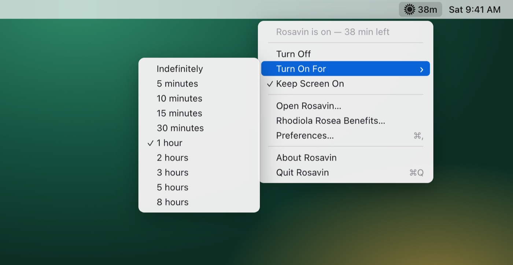
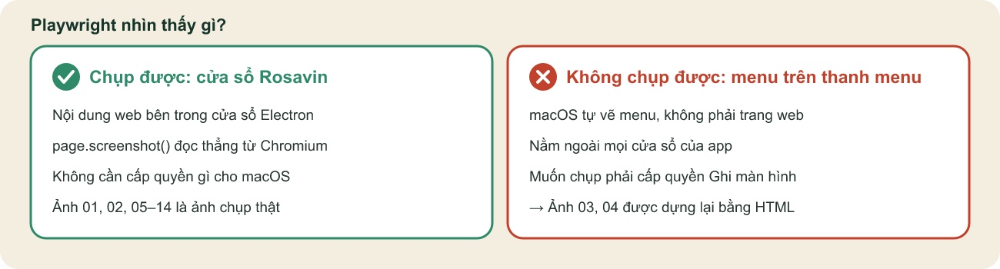
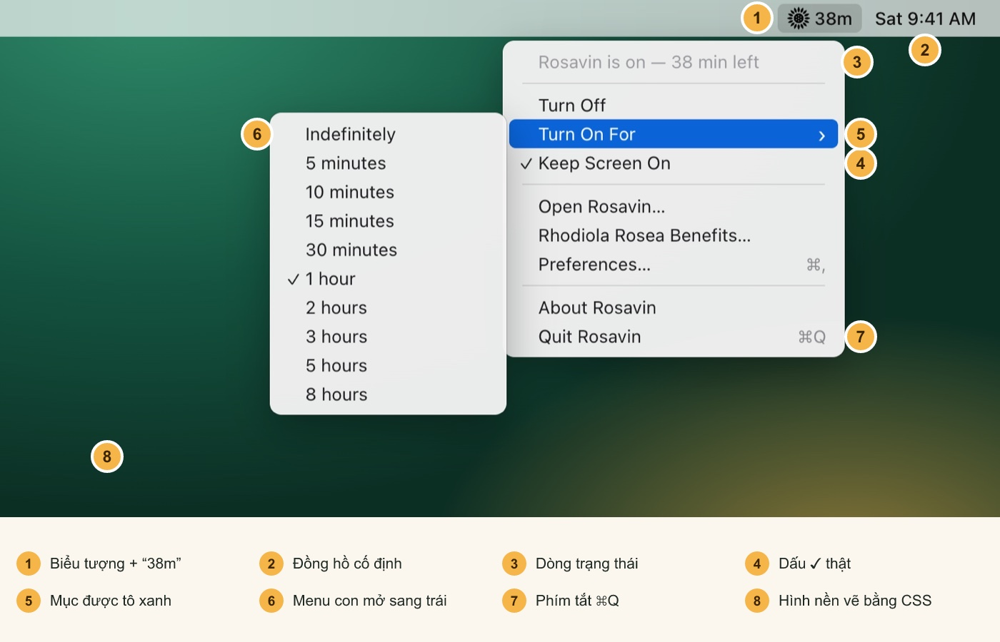
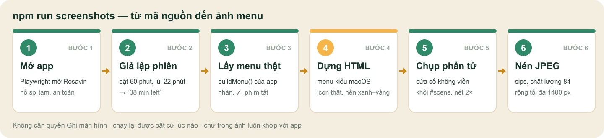

# 📸 Ảnh menu không cần chụp màn hình

**Bức ảnh menu của Rosavin được “dựng” ra như thế nào, và cách bạn tự làm lại**



Bức ảnh trên trông giống hệt một lần bấm vào biểu tượng hoa hướng dương trên thanh menu macOS. Nhưng nó **không được chụp từ màn hình máy Mac nào cả**. Không có ai bấm phím ⌘⇧4, cũng không có công cụ chụp màn hình nào chạy. Đồng hồ “Sat 9:41 AM” và con số “38m” đều do một đoạn script đặt ra.

Tài liệu này kể lại hành trình của bức ảnh: từ mã nguồn của Rosavin đến tệp `03-menu.jpg` trong bộ hướng dẫn sử dụng.

## Mục lục

1. [Câu trả lời ngắn](#câu-trả-lời-ngắn)
2. [Vì sao không chụp thẳng được?](#vì-sao-không-chụp-thẳng-được)
3. [Giải phẫu bức ảnh](#giải-phẫu-bức-ảnh)
4. [Sáu bước từ mã nguồn đến ảnh](#sáu-bước-từ-mã-nguồn-đến-ảnh)
5. [Tự tạo lại ảnh trên máy bạn](#tự-tạo-lại-ảnh-trên-máy-bạn)
6. [Tùy biến bức ảnh](#tùy-biến-bức-ảnh)
7. [Nếu muốn ảnh chụp thật](#nếu-muốn-ảnh-chụp-thật)
8. [Hỏi nhanh – đáp gọn](#hỏi-nhanh-đáp-gọn)

## Câu trả lời ngắn

> 💡 **Tóm gọn trong một câu:** script `scripts/screenshots.mjs` mở Rosavin trong chế độ kiểm thử và đọc **nội dung menu thật** từ app. Sau đó nó vẽ lại menu bằng HTML/CSS theo đúng kiểu macOS, rồi để chính Electron “chụp” trang HTML đó thành ảnh.

Nghĩa là:

| Thành phần trong ảnh | Thật hay dựng lại? |
|---|---|
| Chữ trong menu (Turn Off, Turn On For, Keep Screen On…) | ✅ **Thật**: lấy trực tiếp từ hàm tạo menu của app |
| Dấu ✓ ở “Keep Screen On” và “1 hour” | ✅ **Thật**: trạng thái lúc đó của app |
| Phím tắt ⌘, và ⌘Q | ✅ **Thật**: lấy từ khai báo của menu |
| Biểu tượng hoa hướng dương | ✅ **Thật**: đúng tệp icon app dùng trên thanh menu |
| “38m” và “38 min left” | 🎭 **Giả lập**: phiên 60 phút được lùi lại 22 phút |
| Đồng hồ “Sat 9:41 AM” | 🎭 **Cố định**: 9:41 là giờ quen thuộc trong ảnh giới thiệu sản phẩm của Apple |
| Thanh menu, khung menu, bóng đổ, màu xanh tô sáng | 🎨 **Vẽ lại**: HTML + CSS mô phỏng macOS |
| Hình nền xanh lá – vàng | 🎨 **Vẽ lại**: hai lớp `radial-gradient` theo màu thương hiệu Rhodiola |

## Vì sao không chụp thẳng được?



Các ảnh cửa sổ trong bộ hướng dẫn (màn hình chính, Tùy chọn, hộp thoại Rhodiola…) đều là **ảnh chụp thật**. Công cụ tự động hóa **Playwright** điều khiển Rosavin và gọi `page.screenshot()`. Lệnh này đọc hình ảnh trực tiếp từ Chromium bên trong cửa sổ Electron, nên không cần xin quyền gì của macOS.

Menu thanh menu thì khác:

- 🍎 **macOS tự vẽ nó.** Electron chỉ đưa cho hệ điều hành danh sách các mục. Phần hiển thị do AppKit đảm nhận, không có trang web nào để Playwright chụp.
- 🪟 **Nó nằm ngoài mọi cửa sổ của app.** `page.screenshot()` chỉ thấy được nội dung bên trong cửa sổ.
- 🔒 **Chụp nó cần quyền Ghi màn hình** (Screen Recording). Phải vào Cài đặt hệ thống, cấp quyền cho Terminal, rồi khởi động lại Terminal. Lúc tạo ảnh, quyền này chưa được cấp, và mình cũng không tự thay đổi cài đặt bảo mật của máy bạn.
- 🔁 **Ảnh chụp tay không lặp lại được.** Mỗi lần đổi chữ hay đổi giao diện lại phải chụp lại, căn lại, cắt lại cho cả tiếng Anh lẫn tiếng Việt.

Vì vậy chọn cách thứ ba: **dựng lại menu từ dữ liệu thật**.

## Giải phẫu bức ảnh



1. **Biểu tượng + “38m”.** Icon là tệp `src/assets/tray/trayActiveTemplate@3x.png`, đúng tệp app dùng thật. Chữ “38m” lấy từ `tray.getTitle()`, tiêu đề app đang đặt cạnh biểu tượng.
2. **Đồng hồ.** Một chuỗi cố định: `Sat 9:41 AM` cho bản tiếng Anh và `Th 7 09:41` cho bản tiếng Việt.
3. **Dòng trạng thái** “Rosavin is on — 38 min left”: nhãn thật của mục đầu tiên. Nó bị làm mờ vì app khai báo mục này là `enabled: false`.
4. **Dấu ✓** xuất hiện vì mục “Keep Screen On” đang có `checked: true` trong app.
5. **Mục tô xanh** “Turn On For”: script chọn mục có `id` là `turn-on-for` để làm nổi bật, giả như chuột đang trỏ vào.
6. **Menu con** “Indefinitely… 8 hours”: chính là `submenu` của mục được tô sáng. Một dòng JavaScript đặt nó **sang bên trái**, giống cách macOS mở menu con khi gần mép phải màn hình.
7. **Phím tắt ⌘Q, ⌘,** đổi từ khai báo `CmdOrCtrl+Q` của Electron sang ký hiệu ⌘.
8. **Hình nền** là hai lớp gradient: xanh lá đậm từ góc trên bên trái và ánh vàng từ góc dưới bên phải. Đó là màu rễ vàng và lá xanh của Rhodiola.

## Sáu bước từ mã nguồn đến ảnh



### Bước 1 🚀 Mở Rosavin bằng Playwright, trong một hồ sơ tạm

```js
const userData = fs.mkdtempSync(path.join(tmp, `profile-${lang}-`));
fs.writeFileSync(path.join(userData, 'settings.json'),
  JSON.stringify({ language: lang, theme: 'light', trayHintShown: true }));

const app = await electron.launch({
  args: [root],
  env: { ...process.env, ROSAVIN_E2E: '1', ROSAVIN_USER_DATA: userData },
});
```

- `ROSAVIN_USER_DATA` trỏ tới **một thư mục tạm**, nên cài đặt thật của bạn trong `~/Library/Application Support/Rosavin` không bị đụng tới.
- `ROSAVIN_E2E=1` bật “cửa sau” dành cho kiểm thử: app gắn bộ điều khiển phiên (`keepAwake`) và bộ điều khiển menu (`trayController`) vào `global.__rosavin` để script với tới được.

### Bước 2 ⏱️ Giả lập một phiên đã chạy 22 phút

```js
const ka = global.__rosavin.keepAwake;
ka.start({ minutes: 60, keepScreenOn: true });   // bật phiên 60 phút
ka.session.startedAt -= 22 * 60_000;             // "quay ngược" 22 phút
ka.session.endsAt   -= 22 * 60_000;
ka.check();
ka.emit('change', ka.getState());               // báo cho menu và cửa sổ cập nhật
```

> ⏳ Không ai phải ngồi chờ 22 phút. Script chỉ **dời mốc thời gian** của phiên. App tự tính ra còn 38 phút, rồi tự cập nhật “38m” trên thanh menu và dòng “38 min left”.

### Bước 3 📋 Đọc menu thật từ app

```js
const menuData = await app.evaluate(() => {
  const serialize = (menu) => menu.items.map((i) => ({
    id: i.id, type: i.type, label: i.label, enabled: i.enabled,
    checked: i.checked, accelerator: i.accelerator || '',
    submenu: i.submenu ? serialize(i.submenu) : null,
  }));
  const tc = global.__rosavin.trayController;
  return { items: serialize(tc.buildMenu()), title: tc.tray.getTitle().trim() };
});
```

Đây là bước quan trọng nhất. `buildMenu()` là **đúng hàm** Rosavin dùng để tạo menu khi bạn bấm vào biểu tượng. Vì vậy chữ, dấu ✓ và phím tắt trong ảnh luôn khớp 100% với app. Đổi ngôn ngữ sang tiếng Việt thì ảnh tiếng Việt cũng tự đúng.

Kết quả là một mảng dữ liệu, rút gọn như sau:

```json
[
  { "id": "status", "label": "Rosavin is on — 38 min left", "enabled": false },
  { "type": "separator" },
  { "id": "toggle", "label": "Turn Off" },
  { "id": "turn-on-for", "label": "Turn On For", "submenu": [
      { "label": "Indefinitely" }, { "label": "5 minutes" }, "…",
      { "label": "1 hour", "checked": true }, "…" ] },
  { "id": "keep-screen-on", "label": "Keep Screen On", "checked": true },
  "…",
  { "label": "Quit Rosavin", "accelerator": "CmdOrCtrl+Q" }
]
```

### Bước 4 🎨 Dựng “sân khấu” bằng HTML và CSS

Hàm `menuSceneHtml()` biến mảng dữ liệu trên thành một trang HTML gồm ba lớp:

| Lớp | Cách vẽ | Chi tiết bắt chước macOS |
|---|---|---|
| Hình nền | `radial-gradient` xanh lá + lớp `::after` ánh vàng | Giống ảnh nền mặc định có chiều sâu |
| Thanh menu | Cao 28 px, nền trắng mờ 72 %, `backdrop-filter: blur(20px)` | Hiệu ứng kính mờ của macOS |
| Menu và menu con | Bo góc 9 px, nền `rgba(242,242,242,.97)`, bóng đổ 2 lớp | Mục tô sáng màu `#0A64D8`, chữ mờ cho mục bị vô hiệu, dấu ›, ✓, ⌘ |

Mỗi mục menu được vẽ bằng một hàm nhỏ:

```js
const row = (item, { highlighted }) => {
  if (item.type === 'separator') return '<div class="sep"></div>';
  const cls = ['item', item.enabled === false ? 'disabled' : '', highlighted ? 'hl' : ''].join(' ');
  return `<div class="${cls}">
    <span class="check">${item.checked ? '✓' : ''}</span>
    <span class="label">${escapeHtml(item.label)}</span>
    ${item.submenu ? '<span class="chev">›</span>' : `<span class="key">${shortcut(item.accelerator)}</span>`}
  </div>`;
};
```

> 🛡️ Mọi nhãn đều đi qua `escapeHtml()`. Nhờ vậy dù chữ có ký tự đặc biệt như `<`, `&` hay dấu tiếng Việt, trang HTML vẫn hiển thị đúng.

Font chữ dùng `-apple-system`, tức chính font San Francisco của macOS, nên chữ trong ảnh trông như menu thật.

### Bước 5 📸 Để Electron tự chụp trang HTML

```js
const w = new BrowserWindow({
  width: 820, height: 640, frame: false, hasShadow: false,
  webPreferences: { sandbox: true },
});
w.setIgnoreMouseEvents(true);
w.loadURL(`data:text/html;charset=utf-8,${encodeURIComponent(markup)}`);
// ...
await page.$('#scene').then((el) => el.screenshot({ path: raw }));
```

- Một cửa sổ **không viền, không bóng** được mở ra. Trang HTML được nạp thẳng dưới dạng `data:` URL, không cần ghi tệp tạm.
- `setIgnoreMouseEvents(true)` để cửa sổ không “bắt” chuột của bạn trong lúc chụp.
- Playwright chỉ chụp **đúng khối `#scene`**. Màn hình Mac là Retina nên ảnh có độ nét gấp đôi (2×).
- Chụp xong, cửa sổ bị hủy ngay. Toàn bộ quá trình chỉ mất chưa tới một giây.

### Bước 6 🗜️ Nén thành JPEG

```js
execFileSync('sips', ['-s', 'format', 'jpeg', '-s', 'formatOptions', '84',
  '--resampleWidth', '1400', pngPath, '--out', jpgPath]);
```

`sips` là công cụ xử lý ảnh **có sẵn trong macOS**. Nó đổi ảnh PNG sang JPEG chất lượng 84 và thu về chiều rộng 1400 px. Ảnh vẫn sắc nét nhưng nhẹ, hợp để đưa vào README và tệp Word.

Kết quả cuối cùng nằm ở:

```text
docs/images/screenshots/en/03-menu.jpg
docs/images/screenshots/vi/03-menu.jpg
```

## Tự tạo lại ảnh trên máy bạn

Bạn cần một máy Mac đã cài Node.js 20 trở lên. Lần đầu, cài các gói của dự án:

```bash
npm install
```

Sau đó chạy:

```bash
npm run screenshots
```

Bạn sẽ thấy cửa sổ Rosavin nháy lên vài lần (đó là Playwright đang điều khiển app), kèm danh sách ảnh hiện ra trong Terminal:

```text
EN
  ✓ en/01-main-off.jpg
  ✓ en/02-main-on.jpg
  ✓ en/03-menu.jpg
  ✓ en/04-menubar-icons.jpg
  ...
VI
  ✓ vi/01-main-off.jpg
  ...
```

> ⚠️ **Đừng chạm chuột hay bàn phím trong lúc script chạy** (khoảng một phút). Nếu bạn bấm vào cửa sổ khác, một vài ảnh cửa sổ có thể bị chụp hụt. Gặp vậy thì chỉ cần chạy lại lệnh.

Muốn cập nhật luôn tệp Word của hướng dẫn sử dụng:

```bash
npm run docs:docx
```

## Tùy biến bức ảnh

Mọi thứ nằm trong `scripts/screenshots.mjs`. Vài thay đổi thường gặp:

| Bạn muốn… | Sửa ở đâu |
|---|---|
| ⏰ Ảnh hiện “còn 15 phút” thay vì 38 | `simulateSession(app, 60, 22)`: đổi 22 thành 45 |
| 🕘 Đổi giờ trên đồng hồ | Tham số `clock: lang === 'vi' ? 'Th 7 09:41' : 'Sat 9:41 AM'` |
| 🔦 Tô sáng mục khác, ví dụ “Keep Screen On” | `highlightId: 'turn-on-for'` → `'keep-screen-on'`. Chỉ mục có menu con mới hiện menu con. |
| 🌄 Đổi hình nền | Hai dòng `radial-gradient` trong lớp `.scene` của `menuSceneHtml()` |
| 🌙 Menu kiểu tối (Dark Mode) | Đổi nền `.menu, .sub` sang `rgba(40,40,40,.96)` và chữ sang màu trắng |
| 🌐 Thêm ngôn ngữ mới | Thêm ngôn ngữ vào app trước. Ảnh sẽ tự có chữ đúng vì lấy từ `buildMenu()`. |

> 🧪 Mẹo: sau khi sửa, chỉ cần mở tệp `.jpg` trong `docs/images/screenshots/` bằng Quick Look (chọn tệp rồi nhấn phím cách) để xem ngay.

## Nếu muốn ảnh chụp thật

Hoàn toàn được, chỉ là phải làm bằng tay:

1. Mở **Cài đặt hệ thống → Quyền riêng tư & Bảo mật → Ghi màn hình**.
2. Bật quyền cho ứng dụng sẽ chụp (ví dụ Terminal), rồi khởi động lại ứng dụng đó.
3. Bấm vào biểu tượng hoa hướng dương, rê chuột vào “Bật trong”.
4. Nhấn **⌘⇧4**, sau đó nhấn **phím cách** và bấm vào menu để chụp riêng menu đó. Hoặc dùng **⌘⇧5** để chọn vùng.

So sánh nhanh hai cách:

| | Dựng lại bằng HTML (hiện tại) | Chụp thật |
|---|---|---|
| Cần quyền Ghi màn hình | Không | Có |
| Chữ khớp app | Luôn luôn, vì lấy từ mã nguồn | Phụ thuộc lúc chụp |
| Làm lại cho 2 ngôn ngữ | Một lệnh, khoảng 1 phút | Chụp tay từng ảnh |
| Giống macOS từng điểm ảnh | Rất gần, nhưng là bản mô phỏng | Tuyệt đối |
| Thông tin cá nhân lọt vào ảnh | Không: giờ, hình nền, icon khác đều cố định | Có thể lộ icon app khác, giờ thật, tên Wi-Fi… |

## Hỏi nhanh – đáp gọn

**Ảnh dựng lại như vậy có phải “ảnh giả” không?**
Nó là **ảnh minh họa trung thực**: nội dung menu là thật 100%, chỉ phần khung macOS được vẽ lại. Phần đầu `scripts/screenshots.mjs` cũng ghi rõ điều này cho người đọc mã nguồn.

**Ảnh biểu tượng “bật/tắt” (04-menubar-icons) làm thế nào?**
Cũng cùng kỹ thuật: hàm `iconStatesHtml()` đặt hai icon thật (bật và tắt) cạnh nhau trên hai thanh menu vẽ bằng HTML.

**Còn ảnh cửa sổ cài đặt DMG?**
Ảnh `dmg-installer.jpg` là hình minh họa vẽ bằng SVG (hàm `dmgWindowSvg()`), dựng theo đúng bố cục cửa sổ DMG thật: 660 × 400, biểu tượng app bên trái, thư mục Applications bên phải.

**Tệp hướng dẫn này được tạo ra sao?**
Các hình minh họa (sơ đồ quy trình, ảnh đánh số, bảng so sánh) được vẽ bằng SVG trong `make-images.mjs` rồi chuyển thành ảnh bằng thư viện `resvg`. Tệp Word được xuất bằng `pandoc`, dùng chung mẫu định dạng với hướng dẫn sử dụng. Muốn tạo lại, chạy:

```bash
node guides/huong-dan-anh-menu/make-images.mjs
```
